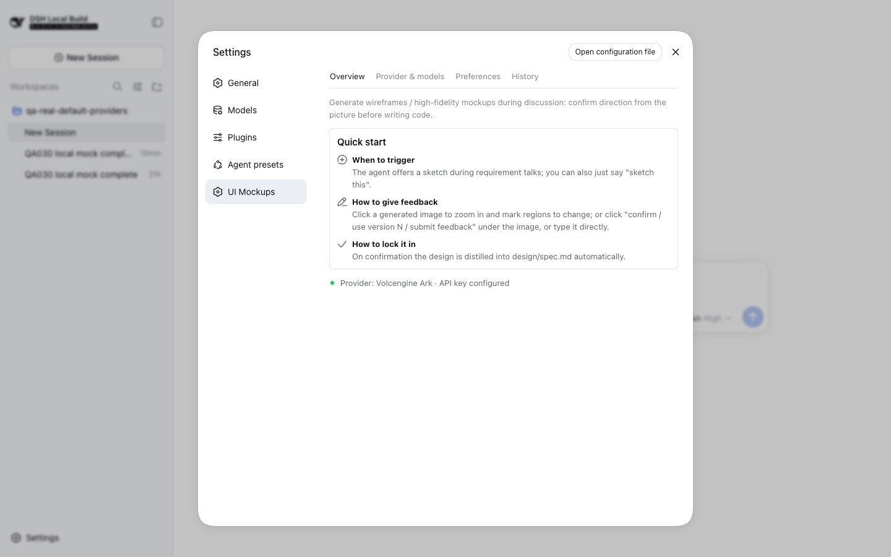

# dsh-ui-mockup

[中文](README.md)

[](https://www.npmjs.com/package/@mackwan84/dsh-ui-mockup-bundle)
[](https://www.npmjs.com/package/@mackwan84/dsh-ui-mockup-bundle)
[](https://github.com/mackwan84/dsh-ui-mockup/releases)
[](LICENSE)

A DSH (DeepSeek Harness) plugin for creating UI wireframes and high-fidelity design images during discovery. It helps users agree on an interface direction before implementation through the loop **generate → review visually → give feedback → confirm and lock → implement from a specification**, avoiding late design surprises.



## Features

- **Inline results:** generated images appear as conversation cards with confirmation, selection, and revision-feedback actions; no asset directory browsing is required.
- **Precise annotation feedback (0.2.0):** click a generated image to open the annotation dialog. Select/Move pans the canvas and selects existing marks; a selected mark can be deleted with a visible action or Delete/Backspace when the canvas is focused. Rectangle, brush, and arrow modes explain how to return to selection. Delete and clear are undoable, marks are automatically numbered (①②③), and Fit / 50% / 100% / 150% / 200% zoom is available. Normalized coordinates are sent with feedback.
- **Direction images and refinement (0.2.0):** use `fastPreview` and the “draft model” tier for a fast high-fidelity direction image. Once the direction is confirmed, choose **Refine this version** instead of spending 1–5 minutes on a pro-tier image before the direction is known.
- **Design asset library:** generated images, anchors, and history live in `$DSH_HOME/mockups/<workspace>/` (using the same slug scheme as DSH sessions). Runtime assets do not land in the project; deliverables such as `design/spec.md` remain in the project.
- **Tiered models:** DashScope defaults to `qwen-image-3.0` for wireframes and `qwen-image-3.0-pro` for high-fidelity images. Volcengine is supported for high-fidelity images and whole-image editing; UI Mockup rejects Volcengine wireframe generation with an actionable provider-switch message.
- **Current Wan support:** DashScope supports only `wan2.7-image` and `wan2.7-image-pro` through the modern asynchronous image endpoint, with text-to-image and one-reference I2I. Wan 2.2/2.6 and the legacy `text2image` endpoint are retired.
- **Three providers:** Alibaba Cloud DashScope is enabled by default; Volcengine Ark and OpenAI-compatible gateways are preconfigured but disabled. In **Settings · UI Mockup · Providers & Models**, click a provider card to switch it. DSH writes a user-layer patch and hot-reloads; no restart is needed.
- **OpenAI-compatible gateways (0.3.0):** supports private aggregation gateways such as one-api / new-api and official OpenAI through the minimal `POST {baseUrl}/images/generations` subset (`model`, `prompt`, `n`, `size`). `b64_json` and `url` response formats are normalized. The connection URL is edited in the unified connection section; model candidates are built-ins plus best-effort `/v1/models` suggestions, with manual input always available. Reference-image and instruction-editing operations are explicitly `NOT_IMPLEMENTED`.
- **Instruction editing:** pass `baseImage` and `editNote` to redraw a whole image from an instruction using Volcengine Seedream 5.0 Pro.
- **Safe semantic references:** models refer to assets as `design/images/<filename>`. Semantic path traversal is rejected at the tool layer, errors do not reveal absolute asset-library paths, and images are not copied into the project.
- **Style consistency:** reference-image mode (I2I) uses a confirmed page as the baseline image so multiple pages keep one visual language.
- **Design locking:** confirmation extracts `design/spec.md`; unconfirmed pages never enter implementation.
- **Rate-limit backoff:** throttled calls are automatically retried (`Throttling` 25s × 2).
- **Localized UI:** the client follows DSH language switching for Chinese and English.
- **Settings panel:** the **UI Mockup** settings entry provides Overview, Providers & Models, Generation Preferences, and Generation History. Preferences persist in the settings namespace; `cordis.yml` remains the composed base layer.
- **Style anchors:** setting a generated image as an anchor causes `ui_mockup` to use it automatically for I2I when no explicit reference is supplied. Clearing history also clears the anchor.
- **Resilience and feedback:** damaged history rows do not break the panel; a new record remains readable after a malformed unterminated tail. Partial image-download failures, attachment-size limits, and unfinished provider switches have explicit messages.

## Annotation interaction

Switching to rectangle, brush, or arrow shows a fixed-height status hint explaining how to return to Select/Move. When an existing mark is selected, use the visible delete action or Delete/Backspace with canvas focus. The complete interaction rules are in the [English product guide](docs/en/guides/product-guide.md#54-annotation-feedback).

## Install

```sh
dsh plugin --profile web add @mackwan84/dsh-ui-mockup-bundle@0.3.0
```

Restart DSH after installation. For local repository development, use a local path instead:

```sh
dsh plugin --profile web add /path/to/dsh-ui-mockup/bundle/ui-mockup
```

### Requirements

- DSH Web profile.
- A desktop viewport of at least 1024px; this is the formal acceptance baseline for the settings panel and result cards.
- Configure at least one image-service credential: `DASHSCOPE_API_KEY` for DashScope, `ARK_API_KEY` for Volcengine Ark, or `OPENAI_COMPAT_API_KEY` plus a gateway URL for an OpenAI-compatible provider.
- Expected duration: wireframes commonly take tens of seconds. A high-fidelity pro model can take 1–5 minutes per image; Volcengine’s synchronous API has a default 300-second window. A generation card shows locally elapsed tool time and continues to accumulate after refresh; it does not prove remote progress or liveness.

## Configuration

Credentials are resolved in the following order. Configure the credential for the active provider: `DASHSCOPE_API_KEY` for DashScope, `ARK_API_KEY` for Volcengine Ark, and `OPENAI_COMPAT_API_KEY` for an OpenAI-compatible gateway.

1. Process environment: for example, run `export DASHSCOPE_API_KEY=sk-xxx` before starting DSH (the same applies to CI and containers).
2. DSH credential storage: `~/.dsh/.credentials.yaml`, written from the DSH Settings · Models page and taking precedence over `.env`.
3. Project `.env`: put the credential in `.env` at the startup directory (usually the project root).
4. DSH home `.env`: `~/.dsh/.env`.

You can also avoid editing files: in **Settings · UI Mockup · Providers & Models**, enter the credential in the provider card. Saving overwrites the stored value without ever revealing it and persists to the credential store described in item 2. The page shows the active source. If a process-environment credential exists, saving is rejected with an explanation. Use **Test connection** to verify the configuration.

### Switch providers (M4)

The installation preconfigures DashScope, Volcengine Ark, and an OpenAI-compatible gateway; the latter two start with `disabled: true`. In **Settings · UI Mockup · Providers & Models**, click a provider card to make it the single active provider. The plugin writes only the affected ids and `disabled` values to the DSH user-layer patch (`~/.dsh/cordis.patch.yml`) and DSH hot-reloads the composed configuration immediately:

```yaml
- id: image-dashscope
  disabled: false
- id: image-volcengine
  disabled: true
- id: image-openai-compat
  disabled: true
```

For package-level details, see the [bundle README](bundle/ui-mockup/README.en.md).

## Use

Ask for a wireframe in a conversation, or let an agent suggest it during discovery. The recommended flow is:

1. Generate a wireframe to validate layout, or use `fastPreview` for a high-fidelity direction image.
2. Click the generated image and annotate the areas that need changes with a rectangle, brush, or arrow.
3. Use Select/Move to pan or select existing marks. Delete marks through the action or Delete/Backspace.
4. Submit numbered regions and feedback; after confirming the direction, choose **Refine this version** or **Confirm and adopt**.
5. The agent regenerates from the feedback or extracts the confirmed design into `design/spec.md`.

## Development

- [English documentation index](docs/README.en.md) — public product and integration documentation
- [Product guide](docs/en/guides/product-guide.md) — current behavior and FAQ
- [Architecture and implementation](docs/en/architecture/overview.md) — component boundaries, capability limits, and implementation facts
- [v0.3.0 release record](docs/en/releases/v0.3.0.md) — candidate acceptance result and remaining release steps

Common commands:

```sh
pnpm test          # Unit and composition tests; no build required first
pnpm typecheck     # Repository-wide TypeScript check
pnpm lint          # ESLint with recommended JS/TS and type-aware rules
pnpm lint:fix      # ESLint automatic fixes
pnpm format        # Prettier formatting across the repository
pnpm format:check  # Prettier format check
pnpm build         # Build the provider and tool packages into lib/
pnpm run pack:all  # Pack six tarballs into dist/
pnpm run publish:all # Translate workspace: ranges, then publish six tarballs in dependency order
```

## License

See [LICENSE](LICENSE).
