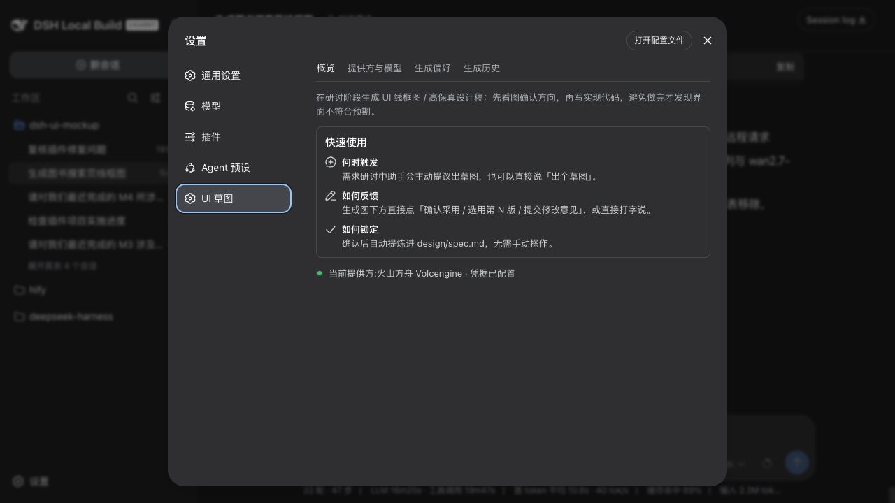

# dsh-ui-mockup

[](https://www.npmjs.com/package/@mackwan84/dsh-ui-mockup-bundle)
[](https://www.npmjs.com/package/@mackwan84/dsh-ui-mockup-bundle)
[](https://github.com/mackwan84/dsh-ui-mockup/releases)
[](LICENSE)

在 DSH（DeepSeek Harness）研讨阶段生成 UI 草图 / 高保真设计稿的插件：让用户在写代码之前
确认界面方向，通过「生成 → 看图反馈 → 确认锁定 → 规格实现」闭环，避免实现完成后才发现界面不符合预期。



## 功能特性

- **内嵌展示**：生成图直接以卡片形式显示在对话中（带确认 / 选用 / 修改意见按钮），无需访问文件目录；
- **设计资产库**：生成图 / 锚点 / 历史集中存于 `$DSH_HOME/mockups/<工作区>/`（slug 与 DSH sessions 同款），
  项目工作区不再落运行时产物；`design/spec.md` 等交付物仍留在项目内；
- **模型分层**：按保真度分层，默认随生效提供方（百炼：线框 `qwen-image-3.0` / 高保真
  `qwen-image-3.0-pro`；火山：线框 `doubao-seedream-4-5-251128` / 高保真
  `doubao-seedream-5-0-pro-260628`）；
- **当前万相能力**：百炼仅支持 `wan2.7-image` / `wan2.7-image-pro`，使用新版异步图像端点，
  支持文生图与单参考图 I2I；Wan 2.2/2.6 与旧 `text2image` 端点已废弃；
- **双提供方**：阿里云百炼 DashScope（默认启用）与火山方舟 Volcengine Ark（预置未启用）；
  设置面板「提供方与模型」页**点卡片一键切换**——写入 DSH 用户层 patch 并热重载，无需重启；
- **指令编辑**：对已生成图传 `baseImage` + `editNote` 走整图指令重绘（火山 Seedream 5.0 Pro，
  比整体重新生成更快更贴近原稿）；
- **安全语义引用**：模型使用 `design/images/<文件名>` 引用资产；语义路径穿越会在工具层拒绝，
  错误不会暴露资产库绝对路径，也无需把图片复制到项目；
- **风格一致**：参考图模式（I2I）以已确认页面为基准图，多页面保持同一品牌视觉；
- **设计锁定**：用户确认后自动提炼 `design/spec.md`，未确认的页面不进入实现；
- **限流退避**：接口限流自动重试（Throttling 25s × 2）；
- **多语言**：客户端 UI 完整支持 DSH 语言切换（zh / en）；
- **设置面板**：设置窗口「UI 草图」入口下四页——概览（快速使用三步）、提供方与模型
  （凭据状态 + 测试连接 + 模型分层默认）、生成偏好（持久化到 settings 命名空间，
  cordis.yml 为组合 base 层）、生成历史（搜索/清空/缩略图回看）；
- **风格锚点**：历史页把某张生成图设为锚点后，`ui_mockup` 未显式传 reference 时
  自动引用该图走 I2I，多页面风格保持一致；清空历史会一并解除锚点；
- **容错与反馈**：损坏历史行不会拖垮面板，无换行坏尾行后的新记录仍可读取；部分图片下载
  失败、附件超限和提供方切换未完成均有明确提示。

## 安装

```sh
dsh plugin --profile web add @mackwan84/dsh-ui-mockup-bundle@0.1.3
```

安装完成后重启 DSH。开发本仓库时可改用本地路径：

```sh
dsh plugin --profile web add /path/to/dsh-ui-mockup/bundle/ui-mockup
```

### 使用环境

- DSH Web profile；
- 桌面端推荐宽度为 1024px 及以上，这是设置面板和结果卡片的正式验收基线；
- 至少配置一个图像服务凭据：阿里云百炼 `DASHSCOPE_API_KEY` 或火山方舟 `ARK_API_KEY`；
- 耗时预期：线框图通常数十秒；高保真 pro 模型默认思考模式，单张 1~5 分钟属正常
  （火山同步 API 默认窗口 300s）。生成卡片显示的是本地已等待时长，不能据此判断远端进度或存活状态。

## 配置

凭据按以下优先级读取，**任选其一即可**；生效提供方决定凭据名：
DashScope 用 `DASHSCOPE_API_KEY`（阿里云百炼），火山方舟用 `ARK_API_KEY`。

1. 进程环境变量：启动 DSH 前 `export DASHSCOPE_API_KEY=sk-xxx`（CI / 容器同理）；
2. DSH 密钥存储：`~/.dsh/.credentials.yaml`（在 DSH 设置 · 模型页写入，优先生效于 .env）；
3. 项目 `.env`：在启动目录（通常是项目根）的 `.env` 中写 `DASHSCOPE_API_KEY=sk-xxx`；
4. DSH 主目录 `.env`：`~/.dsh/.env`。

也可以**不碰任何文件**：直接在 **设置 · UI 草图 · 提供方与模型** 页的凭据卡里填入
新的密钥（写入即覆盖、永不回显，落到方式 2 的密钥存储；该页同时显示当前生效来源，
进程环境变量存在时写入会被拒绝并提示原因），并可点「测试连接」验证。

### 切换提供方（M4）

安装包预置两行 Provider，火山方舟默认 `disabled: true`。在 **设置 · UI 草图 · 提供方与模型**
页直接**点击提供方卡片**即可切换：插件把两行 id 定向 `disabled` 写入 DSH 用户层
patch（`~/.dsh/cordis.patch.yml`，只增改这两行、不触碰其他内容），DSH 热重载组合后
立即生效，无需重启：

```yaml
- id: image-dashscope
  disabled: true
- id: image-volcengine
  disabled: false
```

详见 [bundle README](bundle/ui-mockup/README.md)。

## 使用

在对话中直接说「出个草图」，或由 agent 在需求研讨时主动提议：

```
给图书搜索页出一个线框图 → 看图 → 点「确认采用」或填修改意见 → agent 重新生成/锁定规格
```

## 开发

- [docs/product-guide.md](docs/product-guide.md) — 产品文档（是什么 / 怎么用 / FAQ，含 mermaid 流程图与时序图）
- [docs/implementation-plan.md](docs/implementation-plan.md) — 当前架构、能力边界与关键实现事实
- [docs/volcengine-ark-image-api-facts.md](docs/volcengine-ark-image-api-facts.md) — 火山方舟接口与模型事实
- [docs/browser-test-cases-v0.1.3.md](docs/browser-test-cases-v0.1.3.md) — 0.1.3 可复用浏览器回归用例
- [docs/release-checklist-v0.1.3.md](docs/release-checklist-v0.1.3.md) — 发布门禁、最终验收结论与已知限制

常用命令：

```sh
pnpm test          # 单元 + 组合测试（无需先构建）
pnpm typecheck     # 全仓 TypeScript 检查（根 tsconfig 统一入口）
pnpm lint          # ESLint（js/ts 推荐 + 类型感知规则）
pnpm lint:fix      # ESLint 自动修复
pnpm format        # Prettier 全仓格式化
pnpm format:check  # Prettier 格式检查
pnpm build         # 构建四个包的 lib/
pnpm run pack:all  # 打包 5 个 tarball 到 dist/
pnpm run publish:all # 先由 pnpm 转换 workspace: 协议，再按依赖顺序发布 5 个 tarball
```

## License

详见 [LICENSE](LICENSE)。
