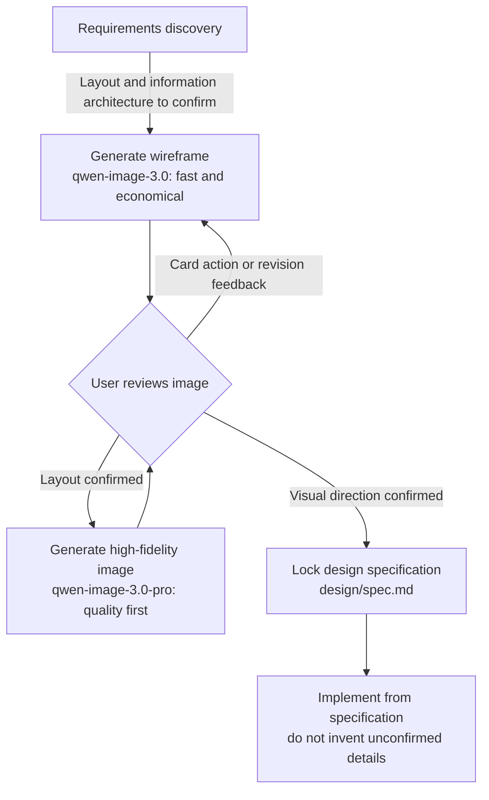
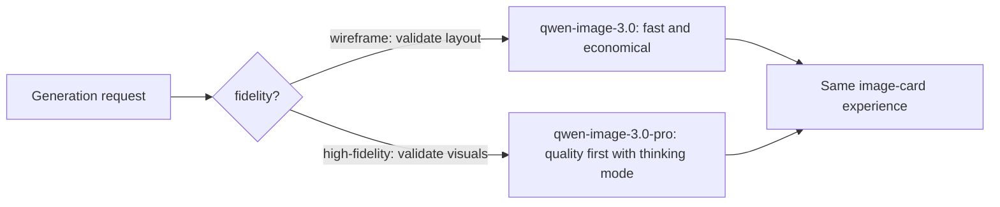

# dsh-ui-mockup · Product Guide

[中文](../../guides/product-guide.md)

> Status: M1–M5 are implemented: image service, three providers, `ui_mockup`, editing, bundle integration, Settings, annotation feedback, and `fastPreview` direction images. M2 delivers in-conversation cards, image routing, and i18n; M3 delivers four Settings pages, history, and style anchors.  
> Audience: individual developers and small teams without a dedicated UI designer.

## 1. What it is

**dsh-ui-mockup** is a DSH (DeepSeek Harness) plugin that moves interface confirmation into discovery, before implementation:

- During a requirements discussion, an agent calls an **image-generation API** to create a UI wireframe or high-fidelity design image.
- Images appear **inline in the conversation**; review them, click an action, and give ordinary-language feedback.
- After confirmation, the design is extracted into `design/spec.md` and **locked as the specification** for implementation.

It solves a painful Vibe Coding failure mode: requirements are text, interfaces exist only in separate imaginations, and the mismatch is discovered after the code already runs.

## 2. The core loop



- A **wireframe** answers “is the layout right?” with inexpensive, fast blocks and labels.
- A **high-fidelity image** answers “does this look right?” and can generate 2–4 visual directions at once.
- **Reference-image mode** uses a confirmed page as the visual baseline for I2I generation, keeping a site coherent rather than relying on chance.

## 3. A typical conversation

```mermaid
sequenceDiagram
    participant U as User
    participant A as Agent
    participant T as ui_mockup tool
    participant P as Image provider

    U->>A: Build a bookstore homepage with search, recommendations, categories, and best sellers
    A->>T: Suggest a wireframe to confirm the layout first
    T->>P: Generate wireframe
    P-->>T: Image URL
    T-->>U: Inline image card with feedback actions
    U->>T: Click Confirm and adopt / submit revision feedback
    Note over U,T: Feedback automatically carries the filename, so multiple images remain unambiguous
    A->>T: High fidelity, count=2–4 visual directions
    T-->>U: Multiple direction cards
    U->>T: Choose a version
    A->>U: Extract design/spec.md and lock the specification
    U->>A: Start implementation; the agent follows the specification
```

## 4. Installation and configuration

### 4.1 Install

```sh
dsh plugin --profile web add @mackwan84/dsh-ui-mockup-bundle@0.3.0
```

The `dsh.bundle.patch` mounts automatically. Restart `dsh web` and the tool will appear in sessions. For local development installation, see the [English README](../../../README.en.md) and [architecture overview](../architecture/overview.md).

### 4.2 Configure an API key

```sh
# .env (recommended; it does not enter conversation history)
DASHSCOPE_API_KEY=sk-xxxx
```

Alternatively, enter a credential and select **Test connection** in Settings.

### 4.3 Advanced configuration (`cordis.yml`)

```yaml
- id: image-dashscope
  name: '@mackwan84/dsh-image-dashscope'
  config:
    wireframeModel: qwen-image-3.0 # wireframe model
    highFidelityModel: qwen-image-3.0-pro # high-fidelity model
    pollTimeoutMs: 600000 # total task-polling limit
    rateLimitRetries: 2 # rate-limit retry count
```

### 4.4 Switch providers (M4)

The bundle includes DashScope (enabled by default), Volcengine Ark, and an OpenAI-compatible gateway. `ctx.image` is a single slot, so exactly one provider is active. In **Settings · UI Mockup · Providers & Models**, click a provider card to switch. The plugin writes id-targeted `disabled` values to the DSH user-layer patch (`~/.dsh/cordis.patch.yml`) and the composition hot-reloads without a restart.

Volcengine uses `ARK_API_KEY`; an OpenAI-compatible gateway uses `OPENAI_COMPAT_API_KEY`, and the API-key row switches its read/write target with the active provider. Instruction editing with `baseImage` and `editNote` is currently Volcengine-only.

Within UI Mockup, Volcengine **only guarantees high-fidelity design images and whole-image instruction editing**. A `fidelity=wireframe` call is rejected before a generation quota is consumed; use DashScope or an OpenAI-compatible gateway for wireframes, or request high fidelity instead. Its retained `wireframeModel` option supports an existing high-fidelity draft fallback and is not a wireframe-quality promise.

OpenAI-compatible gateways target private aggregation gateways such as one-api / new-api. Enter a gateway URL in the provider’s **Connection settings** (only visible for that provider). The UI validates HTTP(S), notes that URLs usually end with `/v1`, persists to the DSH user layer, and hot-reloads within seconds. The support contract is the minimal `model/prompt/n/size` subset plus `b64_json` and `url` responses. Reference-image I2I and instruction editing are unsupported; a style anchor is skipped automatically. An unset URL gives clear generation and connection-test errors. Model tiers are editable comboboxes: built-in recommendations plus best-effort `/v1/models` suggestions, silently falling back when discovery fails; any model name can always be entered manually. The bundle defaults are `gpt-image-2` for wireframes and `gpt-image-2.5-flare` for high fidelity. Saving the URL preserves these deployment defaults unless the user overrides them.

## 5. Using the product

### 5.1 Triggering a mockup

- **Agent initiated:** when requirements are clear and implementation is about to start, built-in prompt rules suggest a mockup.
- **User initiated:** say “make a wireframe”, “give the search page a wireframe”, or “show a high-fidelity option”.

### 5.2 Model tiers



Pass `model` to override the chosen tier. The Settings page can configure each default. `fastPreview` uses an independent **draft model** tier; resolution is explicit `model` → draft model → wireframe tier → the active provider’s `wireframeModel`. If all three preferences are blank but the provider has a nonblank `wireframeModel`, a draft uses it; otherwise the tool passes `undefined` to the provider. Ordinary high-fidelity generation still uses its high-fidelity default. Wan supports only the current 2.7 family; Web/Mobile defaults are `2048*1152` / `1152*2048`, and text-to-image plus one-reference I2I use the modern asynchronous endpoint.

### 5.3 Image-card actions

| Action                   | Effect                                                                                                                              |
| ------------------------ | ----------------------------------------------------------------------------------------------------------------------------------- |
| Confirm and adopt        | The only primary action. Sends a fixed Chinese confirmation message with filename so the agent can extract `design/spec.md`.        |
| Refine this version      | Outlined secondary action shown only for a draft; moves that direction into high-fidelity refinement.                               |
| Choose version N         | Selects one image from a multi-direction run; neutral dropdown, with fixed Chinese model-visible message.                           |
| Set as anchor            | Neutral state action. On success, every open card synchronizes to the one current anchor; old cards keep no stale tag.              |
| Open original            | At the bottom of the annotation dialog, opens the original PNG / JPEG / WebP in a new tab.                                          |
| Submit revision feedback | Outlined secondary action. Requires non-empty feedback; the agent prefers whole-image `baseImage + editNote` redraw when available. |
| Click image              | Opens the annotation dialog described in §5.4.                                                                                      |

### 5.4 Annotation feedback

Click a generated image to enter the annotation dialog.

- **Tools:** Select/Move is the default and pans the canvas or selects an existing mark. Rectangle, freehand brush, and arrow modes explain how to return to Select/Move. Marks are auto-numbered ①②③ and available in red/yellow/blue. The zoom menu offers Fit (default, complete image at no more than 100%), 50%, 100%, 150%, and 200%.
- **Edit an existing mark:** in Select/Move, click inside a rectangle or near a brush/arrow stroke. The selected mark gets a dashed frame and DSH selected-state label. Use the adjacent **Delete** action, or focus the canvas and press Delete / macOS Backspace. Deletion and clear are undoable. Pressing deletion keys in feedback inputs or toolbar buttons never removes marks.
- Submit feedback at the bottom: **numbered marks + normalized coordinate projection + feedback** become one message. The agent can then describe where to edit spatially instead of inferring location from wording.
- Submitting feedback without an annotation remains valid text-only feedback.
- For multiple annotation passes on one image, the agent uses only the latest pass.
- The edit base is always the **original image**. An annotation image is a locator, not `baseImage`; the host rejects invented annotation-image base paths with an actionable error.

Editing quality depends on the active provider. DashScope currently uses a more precise full redraw from the annotation description; switch to Volcengine for instruction-based redraw closer to the original.

### 5.5 Direction images and refinement (`fastPreview`)

A high-fidelity pro-tier image can take 1–5 minutes. Since a wrong direction wastes that wait, 0.2.0 adds this flow:

- During high-fidelity exploration, the agent sends `fastPreview` to create a **direction image** with the Settings **draft model** tier. You can also ask for a direction image explicitly.
- Once the direction is confirmed, click **Refine this version** on the result card, or ask the agent to refine directly. The same description runs without `fastPreview`; the draft filename identifies the chosen direction but is not sent as `reference`, `baseImage`, or `editNote`.
- A direction image appears in history with a **Draft** tag and can be filtered. Setting it as the style anchor gives a one-time warning because using a fast draft as the site-wide baseline can harm quality.
- `fastPreview` is ignored for `fidelity='wireframe'`, because the wireframe tier is already the fast tier; the result explains this.

### 5.6 Multi-page visual consistency

For later pages in one site, use a confirmed page as `reference` during high-fidelity generation. Qwen Image, Wan 2.7, and Seedream can preserve palette, type, and corner treatment from the baseline. Set a history image as an anchor from a conversation card; history lives at `$DSH_HOME/mockups/<workspace>/history.jsonl`. The history page always shows the total under the current search/filter and displays pagination only when results exceed one page.

### 5.7 Locking the design

- After confirmation, the agent extracts page inventory, layout, components, color roles, typography, spacing, and key interactions into `design/spec.md`.
- **Unconfirmed pages and items marked “unconfirmed” in the specification do not enter implementation.**
- Generated images remain in `$DSH_HOME/mockups/<workspace>/images/` and can be revisited from conversation cards or Settings.

## 6. FAQ

| Question                                             | Answer                                                                                                                                                                                                                                                           |
| ---------------------------------------------------- | ---------------------------------------------------------------------------------------------------------------------------------------------------------------------------------------------------------------------------------------------------------------- |
| Generation is slow                                   | A pro model normally takes 1–5 minutes per image. Use `fastPreview` to settle direction first, or use a standard wireframe model. The card shows locally elapsed tool time, not remote progress or liveness.                                                     |
| What is annotation feedback?                         | Click an image, annotate areas with rectangle/brush/arrow, then submit feedback. Marks are numbered and normalized coordinates travel with the message; selected marks can be deleted with the action or Delete/Backspace.                                       |
| What is a direction image?                           | It is a fast high-fidelity exploration using `fastPreview` and the draft-model tier. Confirm it, then use **Refine this version** for the final tier.                                                                                                            |
| Why was only the marked area not changed?            | Local-edit quality depends on provider capability. Volcengine performs whole-image instruction redraw; DashScope currently regenerates the whole image from a more precise description. The product does not promise “change only this region and nothing else.” |
| What if I hit rate limits?                           | The plugin backs off and retries (25s × 2). If it still fails, wait a minute or two or reduce parallel image count.                                                                                                                                              |
| Why is text garbled?                                 | Long Chinese body text is a model limitation. Prompts favor short common labels; reduce text density or try `qwen-image-3.0-pro`.                                                                                                                                |
| Can an international gateway use qwen-image-3.0-pro? | A mainland-China key uses `dashscope.aliyuncs.com`; the international gateway needs an international account.                                                                                                                                                    |
| Editing versus regeneration                          | Editing (`baseImage + editNote`) redraws from the original and is faster and closer to it; it is Volcengine-only. Regeneration redraws the full image and suits major layout or style changes.                                                                   |
| Volcengine timed out                                 | The synchronous default is 300s (`requestTimeoutMs` is configurable). Reduce count or enlarge the window for 4K/multi-image workloads.                                                                                                                           |
| I see `NETWORK_ERROR`                                | The DSH server experienced a network break, reset, or transport interruption to the gateway. It is distinct from `TIMEOUT`; check networking, proxy, and gateway URL, then retry.                                                                                |
| Which viewport is supported?                         | The formal baseline is desktop ≥1024px. Narrower windows are constrained by the host Settings modal and are not guaranteed.                                                                                                                                      |
| Why cannot the agent inspect the image?              | This needs a multimodal model. A text-only conversation falls back to the user describing confirmation and the agent transcribing it.                                                                                                                            |
| Where are generated images?                          | `$DSH_HOME/mockups/<workspace>/images/`; metadata is in sibling `history.jsonl`.                                                                                                                                                                                 |
| Image succeeded but history persistence failed       | The image remains usable in the asset library but this run is absent from history. Check `$DSH_HOME/mockups/` permissions; the product does not backfill failed records.                                                                                         |
| Does it read my conversation?                        | No. Keys resolve through the credentials seam / environment variables, and requests only go to the configured gateway.                                                                                                                                           |
| One image in a multi-image run failed to download    | Successful images still appear; the card reports the failed count and reason. If all fail, the tool fails.                                                                                                                                                       |
| Provider switch did not apply immediately            | The panel reports that switching is still in progress. Retry later or inspect DSH configuration/logs; previous-provider defaults are cleared during the transition.                                                                                              |

## 7. Development and contribution

- Repository structure, dependency strategy, and milestones: [architecture overview](../architecture/overview.md).
- Candidate acceptance and remaining release work: [v0.3.0 release record](../releases/v0.3.0.md).
- Local development: `pnpm install && pnpm build && pnpm test` (includes real loader-composition tests).
- Real API smoke test: `DASHSCOPE_API_KEY=sk-xxx npx tsx scripts/generate-smoke.ts`; for Volcengine: `ARK_API_KEY=ark-xxx npx tsx scripts/generate-smoke.ts --provider volcengine`.
- Publishing order: `dsh-image` → `dsh-image-dashscope` → `dsh-image-volcengine` → `dsh-image-openai-compat` → `dsh-tool-ui-mockup` → bundle.
