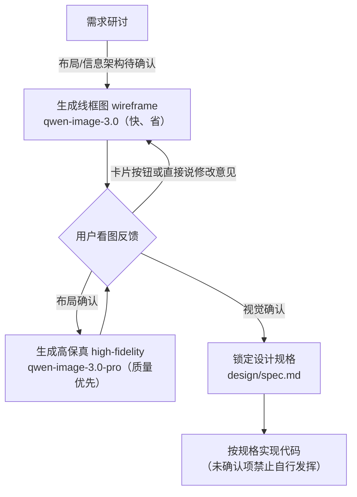
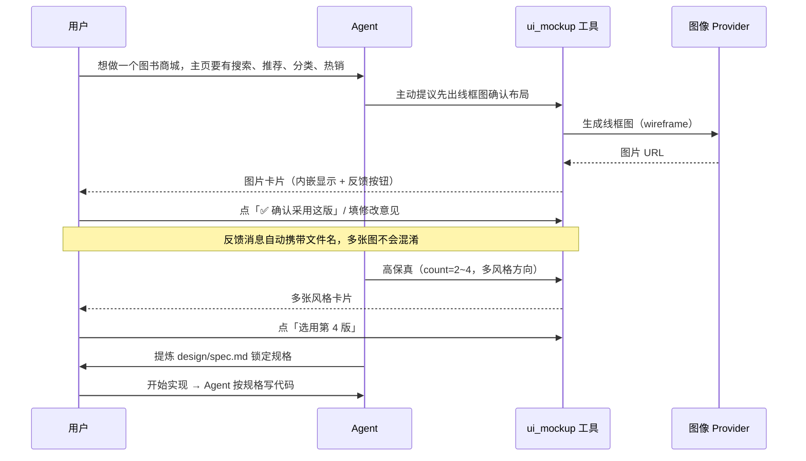
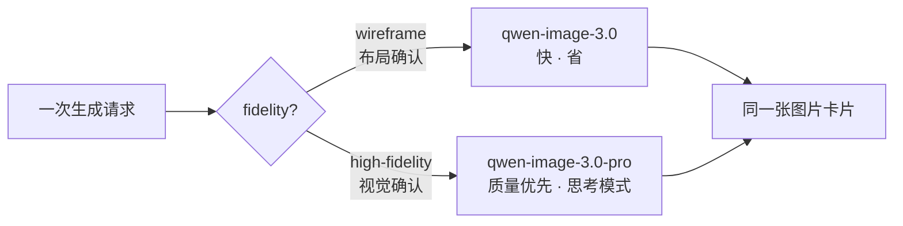

# dsh-ui-mockup · 产品文档

> 状态：M1–M4 已实现（image 服务 + 双 Provider + ui_mockup 工具 + 编辑模式 + bundle 挂载 + 设置面板）；
> M2 已实现（对话内卡片 / 图片路由 / i18n）；M3 已实现（设置面板 4 页 / 生成历史 / 风格锚点）。
> 面向用户：个人开发者、无专业 UI 设计师的小团队。

## 1. 这是什么

**dsh-ui-mockup** 是 DSH（DeepSeek Harness）的插件，把「界面设计确认」前移到写代码之前的研讨阶段：

- 在讨论需求时，让智能体调用**图像生成接口**产出界面草图（线框图 / 高保真设计稿）；
- 图片**内嵌显示在对话里**，你直接看图、点按钮、说人话反馈；
- 你确认后，设计被提炼为 `design/spec.md` **锁定为规格**，之后写代码以它为准。

它解决 Vibe Coding 最痛的问题之一：**需求用文字描述、界面只存在于各自想象里，代码写完运行起来才发现不是想要的**。

## 2. 核心闭环



- **线框图**回答"布局对不对"：黑白灰块 + 中文区块标注，快且便宜；
- **高保真**回答"好不好看"：可一次出 2~4 个风格方向供挑选；
- **参考图模式**：已确认的页面作为风格基准，新页面图生图生成——全站视觉一致不再靠运气。

## 3. 一次典型会话



## 4. 安装与配置

### 4.1 安装

```sh
dsh plugin --profile web add @mackwan84/dsh-ui-mockup-bundle@0.1.3
```

安装完成即自动挂载（`dsh.bundle.patch`），重启 `dsh web` 后工具出现在会话中。
开发期安装方式见 [README](../../README.md) 与 [implementation-plan](../architecture/overview.md)。

### 4.2 配置 API Key（二选一）

```sh
# .env（推荐，不进会话记录）
DASHSCOPE_API_KEY=sk-xxxx
```

或使用设置面板（M3 交付）填写并"测试连接"。

### 4.3 高级配置（cordis.yml）

```yaml
- id: image-dashscope
  name: '@mackwan84/dsh-image-dashscope'
  config:
    wireframeModel: qwen-image-3.0 # 线框图模型
    highFidelityModel: qwen-image-3.0-pro # 高保真模型
    pollTimeoutMs: 600000 # 任务轮询总时限
    rateLimitRetries: 2 # 限流重试次数
```

### 4.4 切换提供方（M4）

安装包同时内置阿里云百炼（默认启用）与火山方舟两个 Provider（`ctx.image` 单槽位，
同时只生效一个）。在 **设置 · UI 草图 · 提供方与模型** 页**点击提供方卡片**即可切换：
插件把两行 id 定向 `disabled` 写入 DSH 用户层 patch（`~/.dsh/cordis.patch.yml`），
组合热重载后立即生效，无需重启。

火山方舟用 `ARK_API_KEY` 凭据（面板凭据卡随生效提供方自动切换读写目标）。
编辑模式（`baseImage` + `editNote` 指令重绘）当前仅火山方舟支持。

## 5. 使用指南

### 5.1 触发

- **Agent 主动**：需求基本明确、准备写代码前，会主动提议出草图（提示词规则内置）；
- **你直接说**："出个草图"、"给搜索页来张线框图"、"看看高保真效果"。

### 5.2 模型分层（自动选择）



可传 `model` 参数覆盖（线框图如 `qwen-image-2.0`、`wan2.7-image`，高保真如
`qwen-image-2.0-pro`、`wan2.7-image-pro`；设置面板「提供方与模型」页可配置各层默认）。
Wan 仅支持当前 2.7 系列，旧 Wan 2.2/2.6 不再兼容。Wan 2.7 Web/Mobile 缺省尺寸为
`2048*1152` / `1152*2048`，文生图与单参考图 I2I 均走新版异步图像端点。

### 5.3 图片卡片的反馈按钮

| 按钮         | 作用                                                             |
| ------------ | ---------------------------------------------------------------- |
| 确认采用这版 | 发送固定中文确认消息（携带文件名），Agent 提炼 `design/spec.md`  |
| 选用第 N 版  | 多方向生成时选定一张；模型可见消息固定中文                       |
| 打开原图     | 新标签打开原始 PNG / JPEG / WebP                                 |
| 提交修改意见 | 非空意见才可提交；Agent 优先用`baseImage + editNote`整图指令重绘 |

### 5.4 多页面风格一致（参考图模式）

同一站点的后续页面：高保真生成时以已确认页面为 `reference`，Qwen Image、Wan 2.7 和
Seedream 均可按基准图保持配色、字体、圆角一致。
生成历史（`$DSH_HOME/mockups/<工作区>/history.jsonl`）可在对话图片卡片一键「设为锚点」（M3）。

### 5.5 设计锁定

- 你确认后，Agent 把设计提炼进 `design/spec.md`：页面清单、布局、组件清单、配色角色、字体、间距、关键交互；
- 规则约束：**未确认的页面 / 规格中标记"未确认"的项，不进入实现**；
- 生成的图片保存在设计资产库 `$DSH_HOME/mockups/<工作区>/images/`，可随时在对话卡片或设置面板回看。

## 6. 常见问题

| 问题                              | 说明                                                                                                                                                  |
| --------------------------------- | ----------------------------------------------------------------------------------------------------------------------------------------------------- |
| 生成很慢                          | pro 模型默认开启思考模式，单张 1~5 分钟属正常；线框图用标准模型会快很多。卡片按工具调用时间显示本地已等待时长，刷新后继续累计；不能证明远端进度或存活 |
| 触发限流了怎么办                  | 插件自动退避重试（25s × 2）；仍失败请稍等一两分钟，或减少并行张数                                                                                     |
| 文字乱码                          | 大段中文正文乱码属模型侧限制；提示词已引导用简短常见短语占位（0.1.3 起），可进一步降低文字密度或试 `qwen-image-3.0-pro`                               |
| qwen-image-3.0-pro 国际网关能用吗 | 国内 key 只能走国内网关（`dashscope.aliyuncs.com`）；国际网关需要国际站账号                                                                           |
| 编辑模式和重新生成的区别          | 编辑（`baseImage` + `editNote`）在原图上做指令重绘，快且贴近原稿，仅火山方舟支持；重新生成则整图重画，适合大改布局或换风格                            |
| 火山生成超时                      | 同步 API 默认窗口 300s（`requestTimeoutMs` 可配置），超出返回 `TIMEOUT`；4K/多图场景可减少张数或调大窗口                                              |
| 支持的窗口宽度                    | 正式验收基线为桌面 ≥1024px；更窄窗口受宿主设置弹窗布局限制（deepseek-harness 已知问题），暂不承诺                                                     |
| 为什么 Agent 不帮我看图提炼规格   | 该步骤需要多模态模型；纯文本模型会话会降级为"你口述确认 + Agent 转写"                                                                                 |
| 生成图在哪                        | 设计资产库 `$DSH_HOME/mockups/<工作区>/images/`；元数据在同目录 `history.jsonl`                                                                       |
| 会读我的会话吗                    | 不会；Key 通过 credentials seam / 环境变量解析，请求仅发往你配置的网关                                                                                |
| 多图中有图片下载失败              | 已成功图片继续显示，卡片同时说明失败张数和原因；全部失败时工具返回失败                                                                                |
| 提供方切换后没有立即生效          | 面板显示“切换尚未完成”；稍后重试或检查 DSH 配置与日志。切换期间会清除旧提供方的模型默认值                                                             |

## 7. 开发与贡献

- 仓库结构、依赖策略与里程碑见 [implementation-plan.md](../architecture/overview.md)；
- 发布门禁与0.1.3验收结论见 [release-checklist-v0.1.3.md](../releases/v0.1.3.md)；
- 本地开发：`pnpm install && pnpm build && pnpm test`（含 Loader 真实组合测试）；
- 真实 API 冒烟：`DASHSCOPE_API_KEY=sk-xxx npx tsx scripts/generate-smoke.ts`
  （火山分支：`ARK_API_KEY=ark-xxx npx tsx scripts/generate-smoke.ts --provider volcengine`）；
- 发布顺序：`dsh-image` → `dsh-image-dashscope` → `dsh-image-volcengine` → `dsh-tool-ui-mockup` → bundle。
