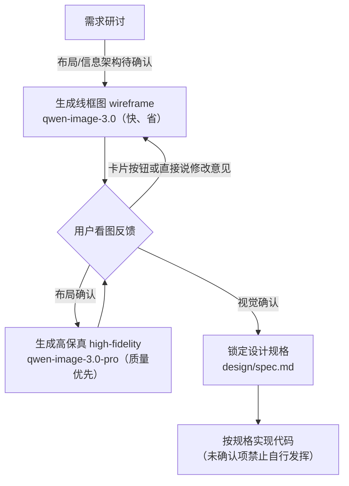
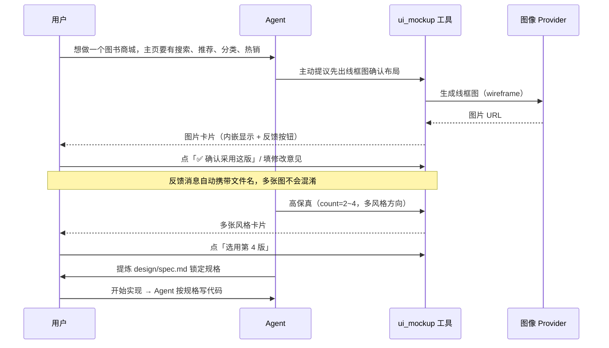
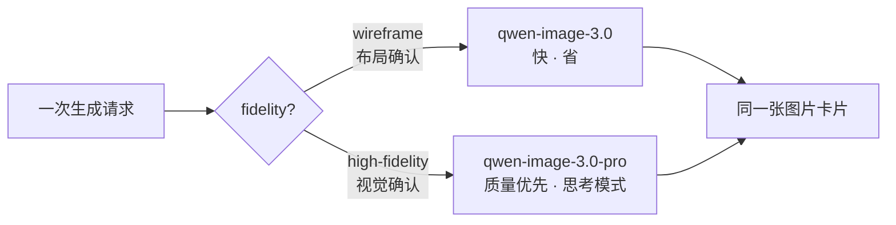

# dsh-ui-mockup · 产品文档

> 状态：M1–M5 已实现（image 服务 + 双 Provider + ui_mockup 工具 + 编辑模式 + bundle 挂载 + 设置面板
>
> - 标注式精准反馈 + fastPreview 方向稿）；M2 已实现（对话内卡片 / 图片路由 / i18n）；
>   M3 已实现（设置面板 4 页 / 生成历史 / 风格锚点）。
>   面向用户：个人开发者、无专业 UI 设计师的小团队。

## 1. 这是什么

**dsh-ui-mockup** 是 DSH（DeepSeek Harness）的插件，把「界面设计确认」前移到写代码之前的研讨阶段：

- 在讨论需求时，让智能体调用**图像生成接口**产出界面草图（线框图 / 高保真设计稿）；
- 图片**内嵌显示在对话里**，你直接看图、点按钮、说人话反馈；
- 你确认后，设计被提炼为 `design/spec.md` **锁定为规格**，之后写代码以它为准。

它解决 Vibe Coding 最痛的问题之一：**需求用文字描述、界面只存在于各自想象里，代码写完运行起来才发现不是想要的**。

## 2. 核心闭环



- **线框图**回答"布局对不对"：黑白灰块 + 中文区块标注，快且便宜；
- **高保真**回答"好不好看"：可一次出 2~4 个风格方向供挑选；
- **参考图模式**：已确认的页面作为风格基准，新页面图生图生成——全站视觉一致不再靠运气。

## 3. 一次典型会话



## 4. 安装与配置

### 4.1 安装

```sh
dsh plugin --profile web add @mackwan84/dsh-ui-mockup-bundle@0.3.0
```

安装完成即自动挂载（`dsh.bundle.patch`），重启 `dsh web` 后工具出现在会话中。
开发期安装方式见 [README](../../README.md) 与 [implementation-plan](../architecture/overview.md)。

### 4.2 配置 API Key（二选一）

```sh
# .env（推荐，不进会话记录）
DASHSCOPE_API_KEY=sk-xxxx
```

或使用设置面板（M3 交付）填写并"测试连接"。

### 4.3 高级配置（cordis.yml）

```yaml
- id: image-dashscope
  name: '@mackwan84/dsh-image-dashscope'
  config:
    wireframeModel: qwen-image-3.0 # 线框图模型
    highFidelityModel: qwen-image-3.0-pro # 高保真模型
    pollTimeoutMs: 600000 # 任务轮询总时限
    rateLimitRetries: 2 # 限流重试次数
```

### 4.4 切换提供方（M4）

安装包同时内置阿里云百炼（默认启用）、火山方舟与 OpenAI 兼容网关三个 Provider
（`ctx.image` 单槽位，同时只生效一个）。在 **设置 · UI 草图 · 提供方与模型** 页
**点击提供方卡片**即可切换：插件把各行 id 定向 `disabled` 写入 DSH 用户层 patch
（`~/.dsh/cordis.patch.yml`），组合热重载后立即生效，无需重启。

火山方舟用 `ARK_API_KEY` 凭据，OpenAI 兼容网关用 `OPENAI_COMPAT_API_KEY`
（连接设置区的 API 密钥行随生效提供方自动切换读写目标）。
编辑模式（`baseImage` + `editNote` 指令重绘）当前仅火山方舟支持。
OpenAI 兼容网关面向 one-api / new-api 等私有聚合网关：网关地址在其
**连接设置** 区的网关地址行中填写（仅该提供方显示；校验 http/https 并提示通常以
`/v1` 结尾，保存写入 DSH 用户层配置并热重载，几秒内生效）；只承诺
`model/prompt/n/size` 最小参数子集与 `b64_json`/`url` 双返回格式，
不支持参考图（I2I，风格锚点会被自动跳过）与指令编辑；网关地址未配置时
生成与测试连接会给出明确错误。模型分层为可编辑组合框：候选 = 内置静态推荐 ∪
从网关 `/v1/models` 拉取的建议（拉取失败静默降级），且**任何时候都可以
直接手填任意模型名**。组合包预置线框图 `gpt-image-2` 与高保真
`gpt-image-2.5-flare`；保存网关地址会保留这两个部署默认值，用户仍可在面板覆盖。
候选弹层与生成偏好的默认尺寸统一复用 DSH `Menu`，
不再显示随浏览器或操作系统变化的原生 `select` / `datalist` 弹层。

## 5. 使用指南

### 5.1 触发

- **Agent 主动**：需求基本明确、准备写代码前，会主动提议出草图（提示词规则内置）；
- **你直接说**："出个草图"、"给搜索页来张线框图"、"看看高保真效果"。

### 5.2 模型分层（自动选择）



可传 `model` 参数覆盖（线框图如 `qwen-image-2.0`、`wan2.7-image`，高保真如
`qwen-image-2.0-pro`、`wan2.7-image-pro`；设置面板「提供方与模型」页可配置各层默认）。
方向稿（`fastPreview`）另有独立的「方向稿模型」档（面板同页配置）；解析顺序为
显式 `model` → 方向稿模型 → 线框图模型档 → 当前 Provider 配置的 `wireframeModel`。
三档偏好为空时，若 Provider 已配置非空白 `wireframeModel`，方向稿使用该线框默认模型；
否则工具传入 `undefined`，交由 Provider 处理。普通高保真仍使用其高保真默认模型。
Wan 仅支持当前 2.7 系列，旧 Wan 2.2/2.6 不再兼容。Wan 2.7 Web/Mobile 缺省尺寸为
`2048*1152` / `1152*2048`，文生图与单参考图 I2I 均走新版异步图像端点。

### 5.3 图片卡片的反馈按钮

| 按钮         | 作用                                                                         |
| ------------ | ---------------------------------------------------------------------------- |
| 确认采用这版 | 唯一主按钮；发送固定中文确认消息（携带文件名），Agent 提炼 `design/spec.md`  |
| 按这版精修   | 仅方向稿显示的描边次按钮；以该方向进入高保真精修                             |
| 选用第 N 版  | 多方向生成时选定一张；中性下拉，模型可见消息固定中文                         |
| 设为锚点     | 中性状态操作；成功后所有已打开卡片同步唯一锚点状态，旧卡片不保留过期标签     |
| 打开原图     | 在标注弹窗底部，新标签打开原始 PNG / JPEG / WebP                             |
| 提交修改意见 | 描边次按钮；非空意见才可提交，Agent 优先用`baseImage + editNote`整图指令重绘 |
| 点击图片     | 进入标注弹窗（见 5.4）                                                       |

### 5.4 标注反馈（圈选要改哪里）

点卡片上的生成图进入标注弹窗：

- 界面参考：[绘图模式提示](../assets/ui-mockup-annotation-drawing.jpg) / [标记选中与删除](../assets/ui-mockup-annotation-selected.jpg)；

- 工具：默认“选择/移动”拖动画布并选择已有标记；切换矩形、自由画笔、箭头后绘制，说明栏会提示如何切回“选择/移动”；自动编号 ①②③；三色（红/黄/蓝）；缩放下拉提供“适合窗口”（默认，完整显示且不超过100%）、50%、100%、150%、200%；
- 编辑已有标记：“选择/移动”模式单击矩形内部或画笔/箭头线段附近即可单选，选中项显示虚线框与 DSH 选中态标签；可点标签旁的“删除”按钮，或在**点过画布后**按Delete/macOS Backspace删除；删除与清空都可用“撤销”恢复；在意见输入框或工具条按钮上按删除键不会误删标记；
- 底部填修改意见后提交：**编号 + 归一化坐标投影 + 意见**作为一条消息发出，Agent 据此用
  空间语言组织编辑指令——「改哪里」不再依赖措辞；
- 不画标注直接提交意见也可以（退化为纯文字反馈）；
- 同一张图多轮标注时，Agent 只以最新一轮为准；
- 编辑时基准图仍是**原图**：标注图只用于定位，不作为 `baseImage`（宿主有硬防护，
  传错会收到可操作错误提示）。

注意：编辑模式（只改标记区域的效果）取决于生效提供方的编辑能力；当前百炼链路标注反馈
走「更精确地描述一次整体重画」，切换到支持编辑的提供方（火山方舟）可获得贴近原稿的
指令重绘。

### 5.5 方向稿与精修（`fastPreview`）

高保真 pro 档单张 1~5 分钟，方向不对时等待成本很高。0.2.0 起：

- Agent 在高保真探索、方向尚未定时会先带 `fastPreview` 出**方向稿**（面板「方向稿模型」档，快模型）；
  该使用时机已写入提示词规则，你也可以直接说“先出个方向稿”；
- 你确认方向后，点方向稿结果卡上的「**按这版精修**」按钮（或让 Agent 直接精修），
  同一描述去掉 `fastPreview` 跑精修档；方向稿文件名只用于标识已确认方向，不作为
  `reference`、`baseImage` 或 `editNote` 参数；
- 方向稿正常进生成历史（带「方向稿」标签，可筛选）；**方向稿设为风格锚点时会收到一次性
  提示**——快模型稿当全站视觉基准是质量陷阱，提示而不禁止；
- `fidelity='wireframe'` 时 `fastPreview` 被忽略（线框档本身已是快模型），结果消息会说明。

### 5.6 多页面风格一致（参考图模式）

同一站点的后续页面：高保真生成时以已确认页面为 `reference`，Qwen Image、Wan 2.7 和
Seedream 均可按基准图保持配色、字体、圆角一致。
生成历史（`$DSH_HOME/mockups/<工作区>/history.jsonl`）可在对话图片卡片一键「设为锚点」（M3）。
历史页始终显示当前搜索与筛选条件下的总条数；只有结果超过一页时才显示翻页控件。

### 5.7 设计锁定

- 你确认后，Agent 把设计提炼进 `design/spec.md`：页面清单、布局、组件清单、配色角色、字体、间距、关键交互；
- 规则约束：**未确认的页面 / 规格中标记"未确认"的项，不进入实现**；
- 生成的图片保存在设计资产库 `$DSH_HOME/mockups/<工作区>/images/`，可随时在对话卡片或设置面板回看。

## 6. 常见问题

| 问题                              | 说明                                                                                                                                                                                                   |
| --------------------------------- | ------------------------------------------------------------------------------------------------------------------------------------------------------------------------------------------------------ |
| 生成很慢                          | pro 模型默认开启思考模式，单张 1~5 分钟属正常；可先出方向稿（`fastPreview`，见 §5.5）确认方向再精修，或线框档用标准模型。卡片按工具调用时间显示本地已等待时长，刷新后继续累计；不能证明远端进度或存活  |
| 标注反馈是什么                    | 点生成图进标注弹窗；默认“选择/移动”可拖动画布、选择已有标记，选中后可点按钮或用Delete/Backspace删除；切换矩形/画笔/箭头后圈选区域（自动编号 ①②③），与意见一并提交；编号归一化坐标随消息发出（见 §5.4） |
| 方向稿是什么                      | 高保真先用快模型出方向稿（`fastPreview` + 面板「方向稿模型」档），确认方向后点「按这版精修」跑精修档；方向稿设风格锚点时会收到一次性提示（见 §5.5）                                                    |
| 标注后为什么没做到只改标记区域    | 局部编辑效果取决于提供方编辑能力：火山方舟支持指令编辑（整图指令重绘），百炼链路当前退回整体重生成（标注让重生成描述更精确）。产品文档不承诺「只改这块、其余不动」                                     |
| 触发限流了怎么办                  | 插件自动退避重试（25s × 2）；仍失败请稍等一两分钟，或减少并行张数                                                                                                                                      |
| 文字乱码                          | 大段中文正文乱码属模型侧限制；提示词已引导用简短常见短语占位（0.1.3 起），可进一步降低文字密度或试 `qwen-image-3.0-pro`                                                                                |
| qwen-image-3.0-pro 国际网关能用吗 | 国内 key 只能走国内网关（`dashscope.aliyuncs.com`）；国际网关需要国际站账号                                                                                                                            |
| 编辑模式和重新生成的区别          | 编辑（`baseImage` + `editNote`）在原图上做指令重绘，快且贴近原稿，仅火山方舟支持；重新生成则整图重画，适合大改布局或换风格                                                                             |
| 火山生成超时                      | 同步 API 默认窗口 300s（`requestTimeoutMs` 可配置），超出返回 `TIMEOUT`；4K/多图场景可减少张数或调大窗口                                                                                               |
| 显示 `NETWORK_ERROR`              | DSH 服务端连接图像网关时发生断网、连接重置或传输中断；它不是生成超时（超时为 `TIMEOUT`）。检查网络、代理和网关地址后由用户重新发起生成                                                                 |
| 支持的窗口宽度                    | 正式验收基线为桌面 ≥1024px；更窄窗口受宿主设置弹窗布局限制（deepseek-harness 已知问题），暂不承诺                                                                                                      |
| 为什么 Agent 不帮我看图提炼规格   | 该步骤需要多模态模型；纯文本模型会话会降级为"你口述确认 + Agent 转写"                                                                                                                                  |
| 生成图在哪                        | 设计资产库 `$DSH_HOME/mockups/<工作区>/images/`；元数据在同目录 `history.jsonl`                                                                                                                        |
| 图片成功但提示历史写入失败        | 图片已经保存在设计资产库并可继续使用，但本次不会出现在生成历史中；检查 `$DSH_HOME/mockups/` 的存储权限后再生成，产品不会自动补写失败记录                                                               |
| 会读我的会话吗                    | 不会；Key 通过 credentials seam / 环境变量解析，请求仅发往你配置的网关                                                                                                                                 |
| 多图中有图片下载失败              | 已成功图片继续显示，卡片同时说明失败张数和原因；全部失败时工具返回失败                                                                                                                                 |
| 提供方切换后没有立即生效          | 面板显示“切换尚未完成”；稍后重试或检查 DSH 配置与日志。切换期间会清除旧提供方的模型默认值                                                                                                              |

## 7. 开发与贡献

- 仓库结构、依赖策略与里程碑见 [implementation-plan.md](../architecture/overview.md)；
- 发布门禁与验收结论见 [0.2.0 发布检查清单](../releases/v0.2.0.md)；
- 本地开发：`pnpm install && pnpm build && pnpm test`（含 Loader 真实组合测试）；
- 真实 API 冒烟：`DASHSCOPE_API_KEY=sk-xxx npx tsx scripts/generate-smoke.ts`
  （火山分支：`ARK_API_KEY=ark-xxx npx tsx scripts/generate-smoke.ts --provider volcengine`）；
- 发布顺序：`dsh-image` → `dsh-image-dashscope` → `dsh-image-volcengine` → `dsh-tool-ui-mockup` → bundle。
