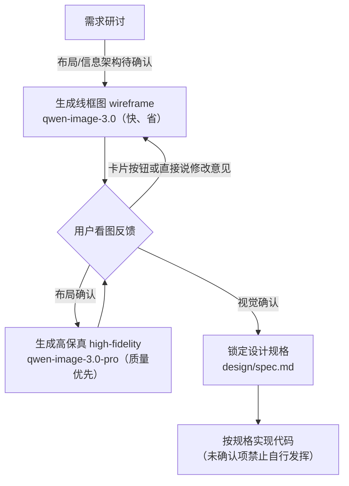
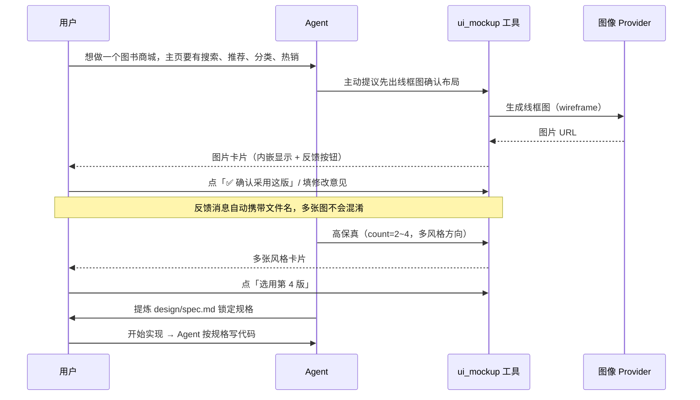
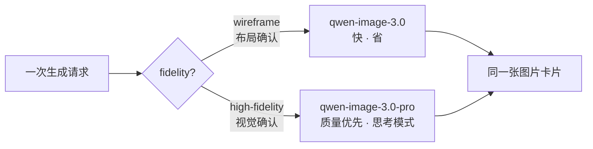

# dsh-ui-mockup · 产品文档

> 状态：M1 已实现（image 服务 + 百炼 Provider + ui_mockup 工具 + bundle 挂载）；
> M2 已实现（对话内卡片 / 图片路由 / i18n）；M3（设置面板 4 页）实施中。
> 面向用户：个人开发者、无专业 UI 设计师的小团队。

## 1. 这是什么

**dsh-ui-mockup** 是 DSH（DeepSeek Harness）的插件，把「界面设计确认」前移到写代码之前的研讨阶段：

- 在讨论需求时，让智能体调用**图像生成接口**产出界面草图（线框图 / 高保真设计稿）；
- 图片**内嵌显示在对话里**，你直接看图、点按钮、说人话反馈；
- 你确认后，设计被提炼为 `design/spec.md` **锁定为规格**，之后写代码以它为准。

它解决 Vibe Coding 最痛的问题之一：**需求用文字描述、界面只存在于各自想象里，代码写完运行起来才发现不是想要的**。

## 2. 核心闭环



- **线框图**回答"布局对不对"：黑白灰块 + 中文区块标注，快且便宜；
- **高保真**回答"好不好看"：可一次出 2~4 个风格方向供挑选；
- **参考图模式**：已确认的页面作为风格基准，新页面图生图生成——全站视觉一致不再靠运气。

## 3. 一次典型会话



## 4. 安装与配置

### 4.1 安装（发布后）

```sh
dsh plugin --profile web add @mackwan84/dsh-ui-mockup-bundle
```

安装完成即自动挂载（`dsh.bundle.patch`），重启 `dsh web` 后工具出现在会话中。
开发期安装方式见 [README](../README.md) 与 [implementation-plan](implementation-plan.md)。

### 4.2 配置 API Key（二选一）

```sh
# .env（推荐，不进会话记录）
DASHSCOPE_API_KEY=sk-xxxx
```

或使用设置面板（M3 交付）填写并"测试连接"。

### 4.3 高级配置（cordis.yml）

```yaml
- id: image-dashscope
  name: '@mackwan84/dsh-image-dashscope'
  config:
    wireframeModel: qwen-image-3.0 # 线框图模型
    highFidelityModel: qwen-image-3.0-pro # 高保真模型
    pollTimeoutMs: 600000 # 任务轮询总时限
    rateLimitRetries: 2 # 限流重试次数
```

## 5. 使用指南

### 5.1 触发

- **Agent 主动**：需求基本明确、准备写代码前，会主动提议出草图（提示词规则内置）；
- **你直接说**："出个草图"、"给搜索页来张线框图"、"看看高保真效果"。

### 5.2 模型分层（自动选择）



可传 `model` 参数覆盖（线框图如 `qwen-image-2.0`、`wan2.7-image`，高保真如 `qwen-image-2.0-pro`、`wan2.7-image-pro`；设置面板「提供方与模型」页可配置各层默认）。

### 5.3 图片卡片的反馈按钮

| 按钮                  | 作用                                                    |
| --------------------- | ------------------------------------------------------- |
| ✅ 确认采用这版       | 发送确认消息（携带文件名），Agent 提炼 `design/spec.md` |
| 选用第 N 版           | 多方向生成时选定一张                                    |
| 🖼 打开原图            | 系统查看器打开 PNG                                      |
| 📝 提交修改，重新生成 | 意见框 + 提交，Agent 按意见重新生成（保持风格一致）     |

### 5.4 多页面风格一致（参考图模式）

同一站点的后续页面：高保真生成时以已确认页面为 `reference`，模型以基准图保持配色、字体、圆角一致。
生成历史（`design/history.jsonl`）可一键「设为锚点」（M3 面板）。

### 5.5 设计锁定

- 你确认后，Agent 把设计提炼进 `design/spec.md`：页面清单、布局、组件清单、配色角色、字体、间距、关键交互；
- 规则约束：**未确认的页面 / 规格中标记"未确认"的项，不进入实现**；
- 生成的图片保存在工作区 `design/images/`，可随时回看。

## 6. 常见问题

| 问题                              | 说明                                                                               |
| --------------------------------- | ---------------------------------------------------------------------------------- |
| 生成很慢                          | pro 模型默认开启思考模式，单张 1~5 分钟属正常；线框图用标准模型会快很多            |
| 触发限流了怎么办                  | 插件自动退避重试（25s × 2）；仍失败请稍等一两分钟，或减少并行张数                  |
| 文字乱码                          | 默认模型已是中文文字渲染第一梯队；个别场景可试 `qwen-image-3.0-pro` 或降低标注密度 |
| qwen-image-3.0-pro 国际网关能用吗 | 国内 key 只能走国内网关（`dashscope.aliyuncs.com`）；国际网关需要国际站账号        |
| 为什么 Agent 不帮我看图提炼规格   | 该步骤需要多模态模型；纯文本模型会话会降级为"你口述确认 + Agent 转写"              |
| 生成图在哪                        | 工作区 `design/images/`；元数据在 `design/history.jsonl`                           |
| 会读我的会话吗                    | 不会；Key 通过 credentials seam / 环境变量解析，请求仅发往你配置的网关             |

## 7. 开发与贡献

- 仓库结构、依赖策略与里程碑见 [implementation-plan.md](implementation-plan.md)；
- 本地开发：`pnpm install && pnpm build && pnpm test`（含 Loader 真实组合测试）；
- 真实 API 冒烟：`DASHSCOPE_API_KEY=sk-xxx npx tsx scripts/generate-smoke.ts`；
- 发布顺序：`dsh-image` → `dsh-image-dashscope` → `dsh-tool-ui-mockup` → bundle。
