# dsh-ui-mockup 浏览器验收报告（复核完成版）

> 执行周期：2026-08-28～2026-08-31
>
> 被测提交：`6a8a41b`
>
> UI 缺陷修复提交：`49017ad`、`a0c6c1f`、`e39ad71`、`3999a47`、`bde1504`、`4cdc541`、`456cc02`
>
> Seedream 迁移提交：`80bb12e`
>
> DSH Web：Local Build `141eb6f`，`http://127.0.0.1:3080/`
>
> 浏览器：Codex 内置浏览器
>
> 当前结论：**全端正式发布 No-Go；桌面限定发布 Conditional Go**——最终提交的核心功能、自动化、桌面 UI、辅助语义和 768px 档位全部通过；但宿主设置弹窗在 320px/375px 下仍只给插件约 28px/83px 内容宽度，整机界面不可正常阅读，ACC-001（S1/P0）继续阻断不限定视口的正式发布。仅当产品明确限定桌面宽度 ≥768px、从干净检出构建并先灰度时可发布。

## 1. 执行范围与限制

本阶段执行了无需删除数据、无需改写 Provider patch、无需输入/传输密钥、无需向模型或图像 Provider 发送新请求的测试：

- 插件入口与设置四页；
- 概览、Provider/凭据只读状态、模型分层、偏好默认值；
- 历史分页、搜索、锚点跨页提示、原图路由；
- 中文/英文、浅色/跟随系统主题；
- 320px/375px 响应式、焦点可见性、页签方向键、控件尺寸与文本对比度抽样；
- 浏览器控制台错误检查。

已获得用户授权并补充执行两家 Provider 真实连接与生成。Volcengine 覆盖线框、高保真双图、Seedream 指令编辑和锚点 I2I；DashScope 覆盖 Qwen 线框、高保真双图、Qwen 锚点 I2I、Wan 旧端点与锚点跳过、异步等待、Provider 热切换后立即生成，以及编辑不支持路径。尚未执行：专用工作区清空历史、凭据写入/清除、真实 401/403/429/超时、跨浏览器兼容矩阵、真实 200%/400% 浏览器缩放和 VoiceOver。

Codex 内置浏览器会主动阻止访问包含编码路径穿越或不存在图片的测试 URL，返回 `ERR_BLOCKED_BY_CLIENT`；因此 ROB-09 的服务端 400/404 结论尚未形成，只确认了浏览器侧阻断。有效原图路由已通过。

## 2. 关键步骤与健康度

### Step 1：首页与设置入口——健康

DSH Web 可打开；工作区加载后“UI 草图”设置入口可发现，设置弹窗结构完整。

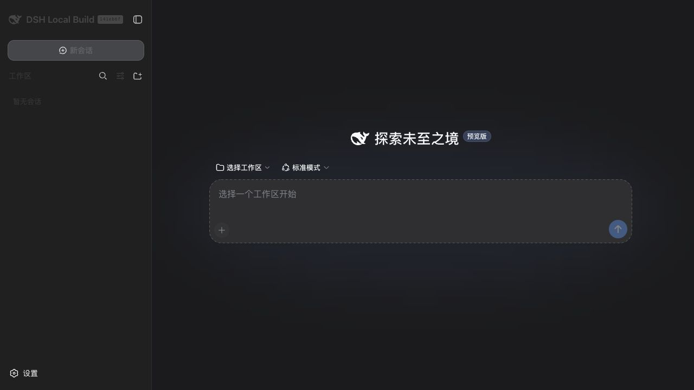

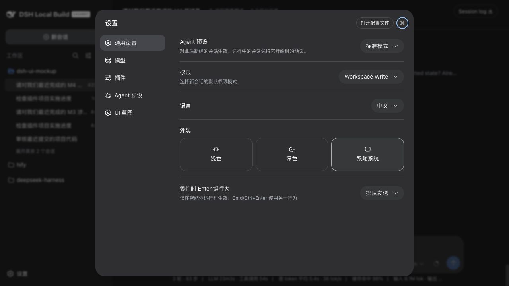

### Step 2：UI 草图概览——修复前基本健康

四个页签、产品说明、三步快速使用、当前 Provider 与凭据状态可见；状态显示为 Volcengine + 凭据已配置，与 Provider 页一致。

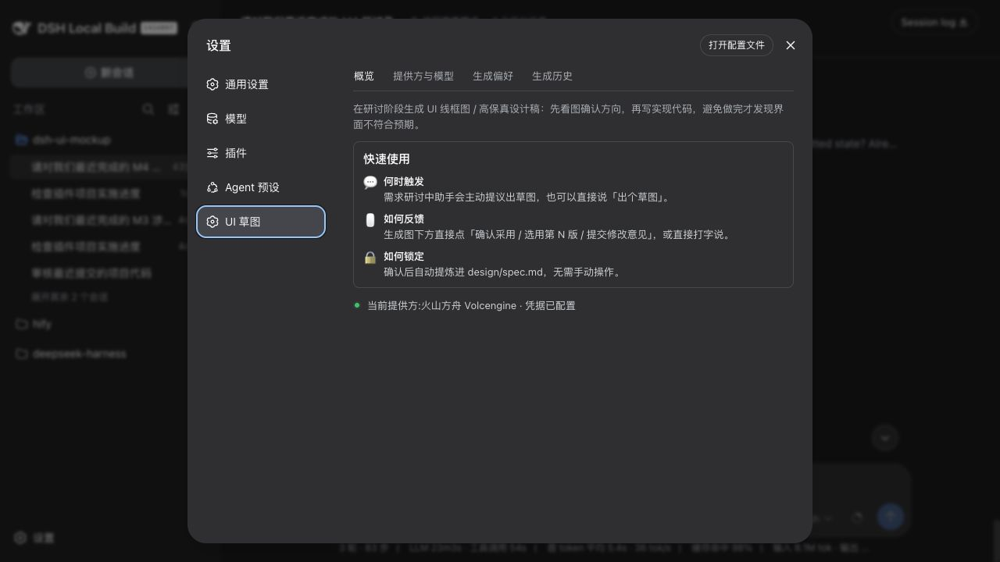

### Step 3：Provider 与凭据——基本健康

Volcengine 唯一选中，凭据名为 `ARK_API_KEY`，凭据仅显示状态与来源，不回显值；模型候选与 Volcengine 一致。未点击测试连接、清除密钥或 DashScope 卡片。

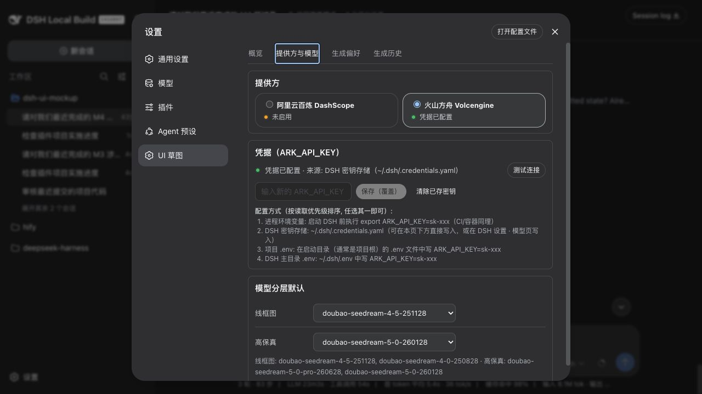

### Step 4：偏好设置——修复前发现 UX 风险

默认值显示为线框图、Web、2 张、10 分钟、跟随 Provider 默认尺寸。把数量改为 3 后保存按钮正确启用；改回原值 2 后保存按钮仍保持启用，说明 dirty 状态只记录“发生过编辑”，没有比较当前草稿与已保存值。

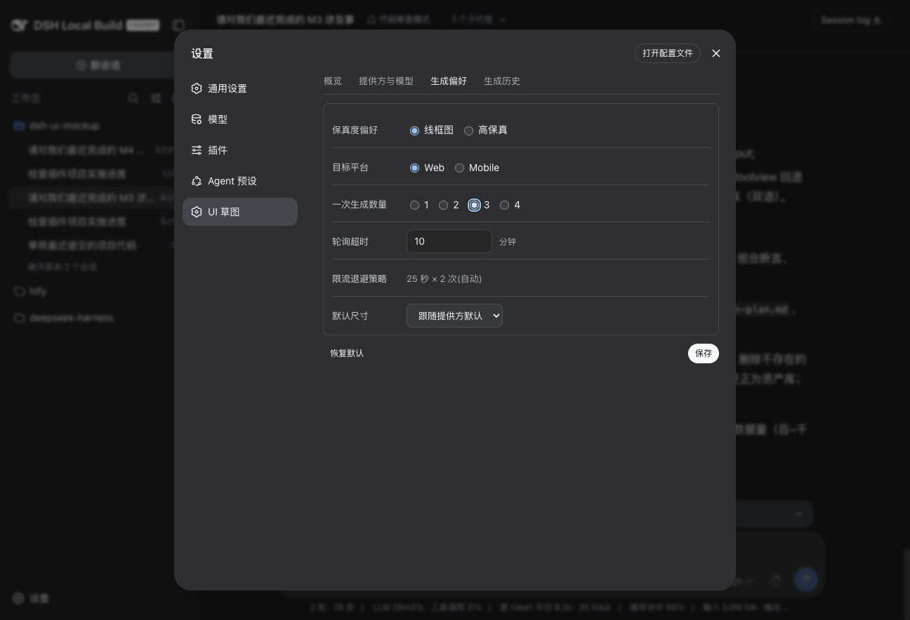

### Step 5：历史、分页、搜索和原图——修复前基本健康

每页 5 条、共 19 条，页码切换与锚点跨页提示正常；“前往”入口可见。搜索必须按 Enter 才生效，输入期间列表保持旧结果，且界面没有搜索按钮或 Enter 提示，存在明显误解风险。原图路由成功打开 1280×720 图片。

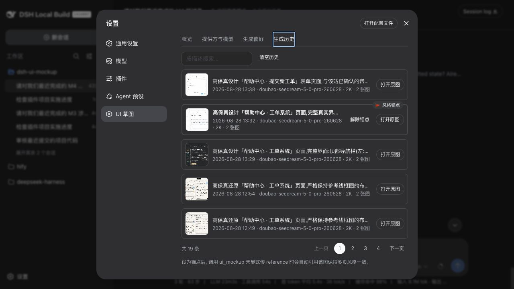

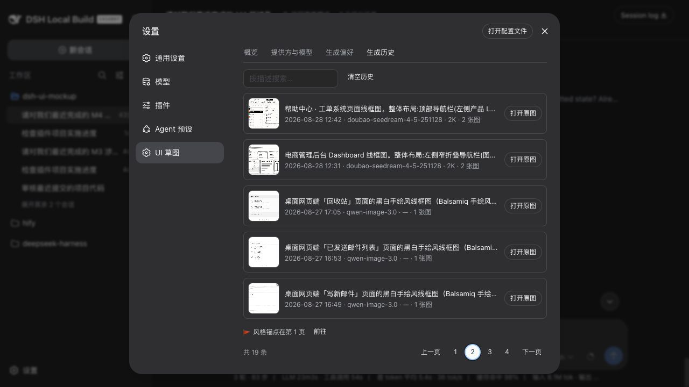

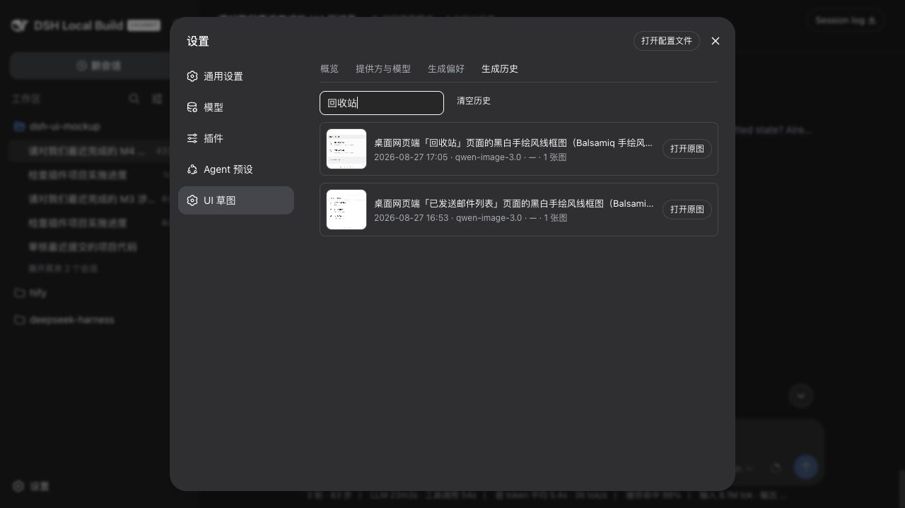

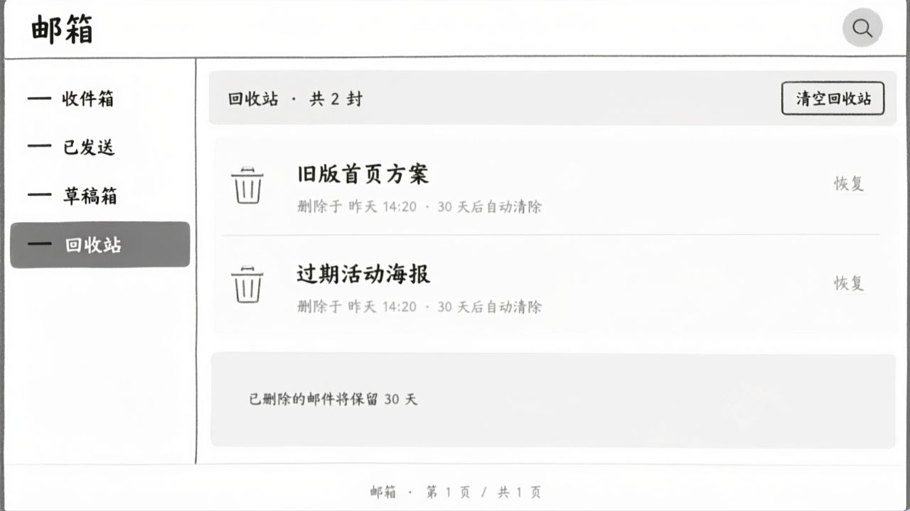

### Step 6：375px 重排——修复前失败

设置弹窗在 375px 下仍保留约 164px 左侧导航，主内容被压缩到约 83px；页签逐字换行、历史卡片文本变成竖排、操作区不可正常阅读，内部出现横向滚动。VIS-12 与 A11Y-10 失败。

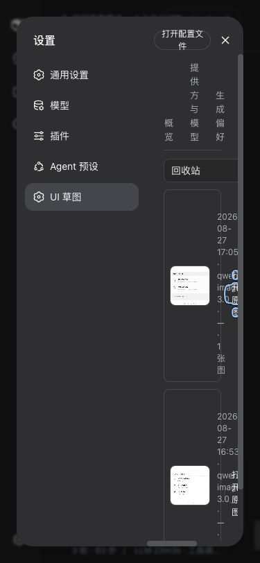

### Step 7：键盘与焦点——修复前部分失败

焦点指示清晰可见，Tab 键可以聚焦页签；但在聚焦“概览”页签后按 ArrowRight，焦点与选中页仍停留在“概览”，不符合标准 tab 交互预期。A11Y-05 失败。

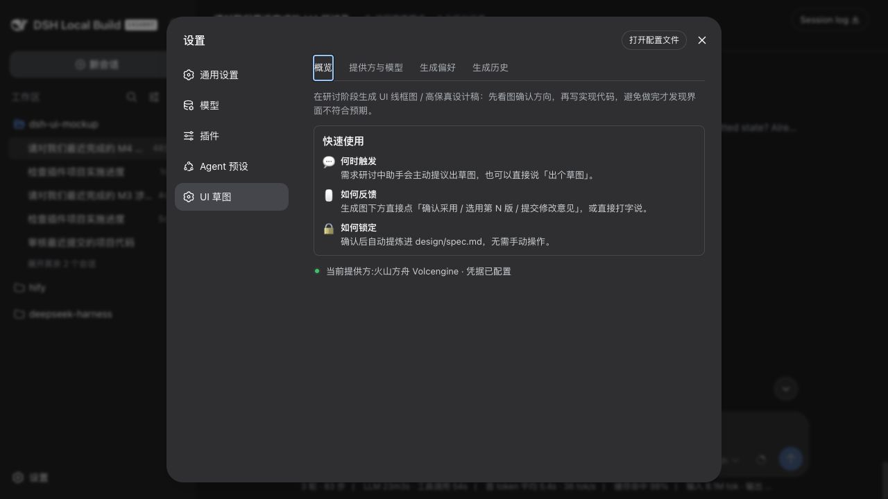

### Step 8：主题与语言——修复前基本健康

中文/英文切换后，设置导航、UI 草图四页、状态、占位、按钮与说明文案均更新；浅色/深色主题主要结构和文字可读。概览的快速使用图标直接使用系统 emoji，其中“鼠标”图标在浅色主题下接近白色、对比度明显不足，且不同 OS 的表现不可控。

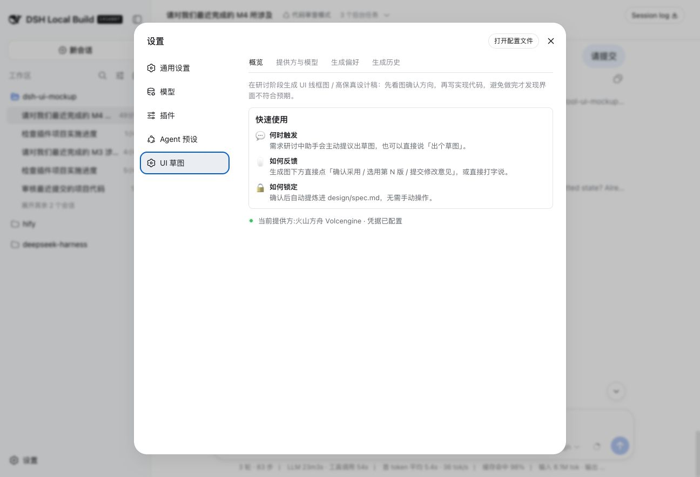

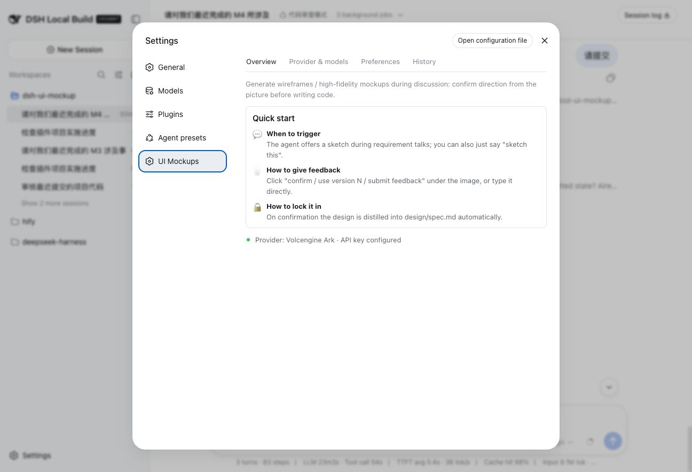

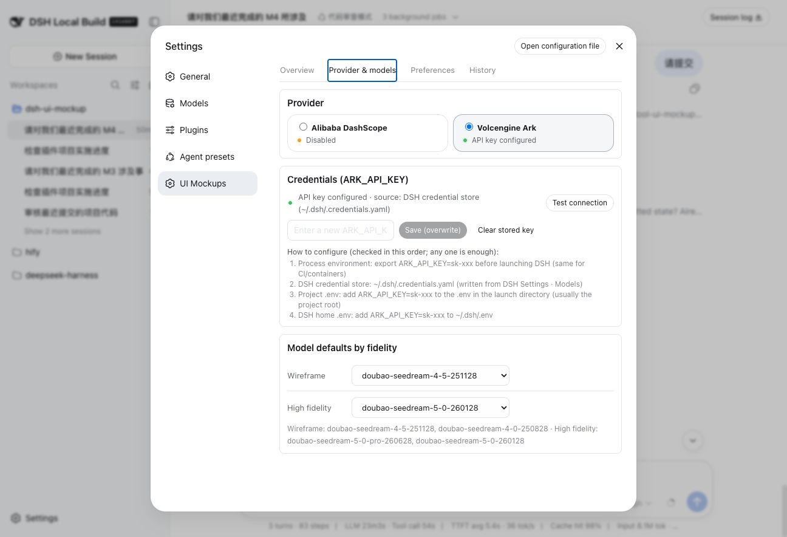

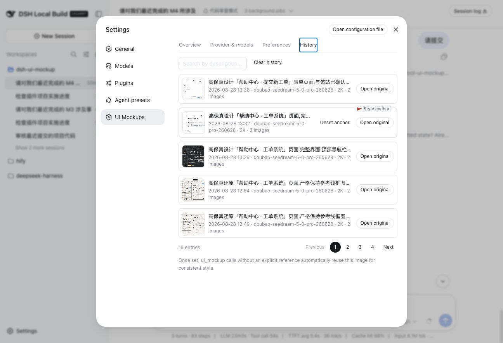

### Step 9：Volcengine 真实连接与单图生成——主链路通过，生成质量有偏差

使用已保存的 `ARK_API_KEY` 执行连接测试，约 1.8 秒后页面显示“凭据有效：鉴权通过，网关可达”，全程未回显密钥。随后通过标准会话调用 `ui_mockup`，约 67 秒完成 1 张 2848×1600 JPEG 线框图生成；会话中正常展示图片、文件名、确认采用、设为锚点、打开原图和提交修改意见控件，资产已落入对应工作区资产库。

卡片“提交修改意见”可展开 textarea；输入临时意见后点击取消不会发送消息，重新展开时草稿仍保留，符合 CARD-09 预期。

生成图包含标题、搜索、筛选和结果区域，但把“结果列表”画成三列网格，中文书名大量乱码，货币符号为 `$`，分页数字乱码。Agent 能主动识别并向用户说明这些偏差，因此工具闭环通过，模型输出质量仅部分满足描述。

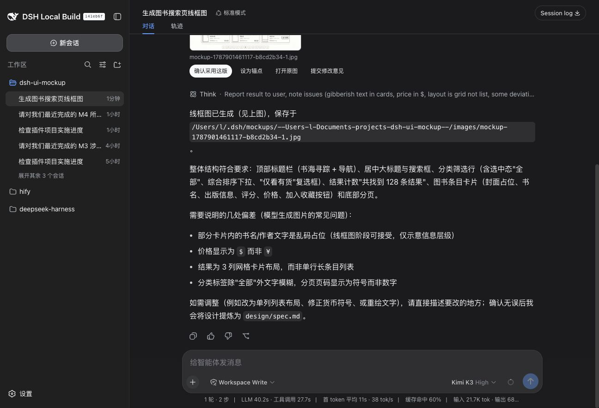

### Step 10：Provider 往返切换——通过

Volcengine → DashScope 约 10.6 秒完成热重载；页面唯一选中 DashScope，凭据切换为 `DASHSCOPE_API_KEY`，模型候选切换为 Qwen/Wan，两层旧模型值均重置为“跟随提供方默认”。DashScope 真实连接测试通过。用户 patch 仅翻转两个 Provider 的 `disabled`。随后 DashScope → Volcengine 约 10.5 秒完成恢复，最终 patch 与测试前一致。

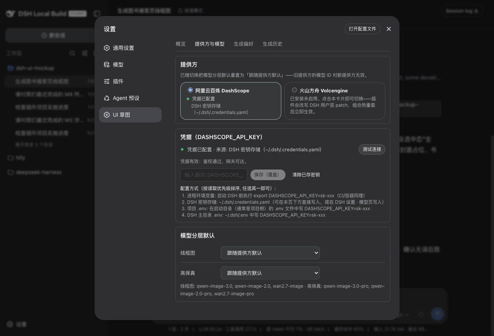

### Step 11：锚点与 SeedEdit——锚点通过，迁移前编辑能力阻断

从真实生成卡片设置锚点成功，卡片文件名即时增加“风格锚点”，历史页同步显示；测试后已恢复原有帮助中心锚点。提交修改意见后，Agent 正确优先调用 SeedEdit，但方舟返回 404 `InvalidEndpointOrModel.NotFound`：`doubao-seededit-3-0-i2i-250628` 不存在或当前账号无权访问。Agent 随后自动降级为整体重生成；最终修正单列列表、人民币和分页，但仍有多选中态、按钮悬浮和乱码偏差。

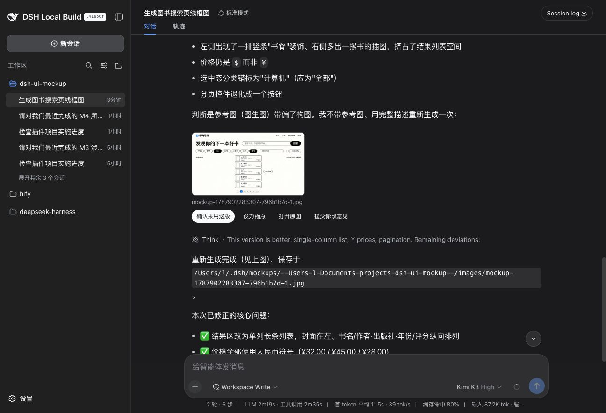

### Step 12：Seedream 5.0 Pro 迁移探针——验证成功

官方迁移资料与用户核对信息表明 SeedEdit 系列已下线，推荐改用 Seedream。保持现有 `baseImage + editNote` 数据流，仅显式覆盖 `model=doubao-seedream-5-0-pro-260628` 时，模型端点可达但默认编辑尺寸 `adaptive` 被 400 拒绝；再仅增加 `size=2048*1152` 后编辑成功。所有可见价格由 `$` 改为 `¥`，三列布局、标题、搜索、筛选和分页位置保持不变。

为避免把缺省值硬编码成横屏尺寸，又追加了 `size=2K` 探针：请求成功并生成 2848×1600 JPEG，宽高比与 2048×1152 基准图一致。会话回复曾误报成 2048×1151，本报告以落盘文件读取结果为准。由此确定迁移缺省尺寸采用 `2K` 档位。

这证明现有编辑架构无需重写，根因是两项默认配置过期：`editModel` 仍指向已下线 SeedEdit，`toArkEditSize()` 默认返回新模型不接受的 `adaptive`。迁移至少需要更新默认编辑模型和缺省尺寸策略，并同步单测与文档。

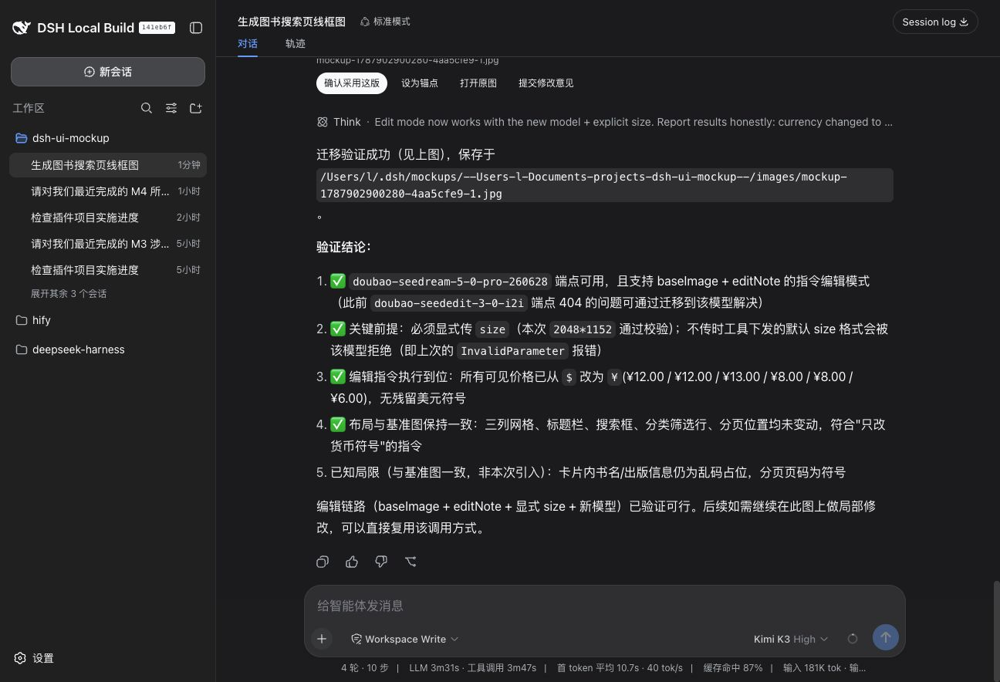

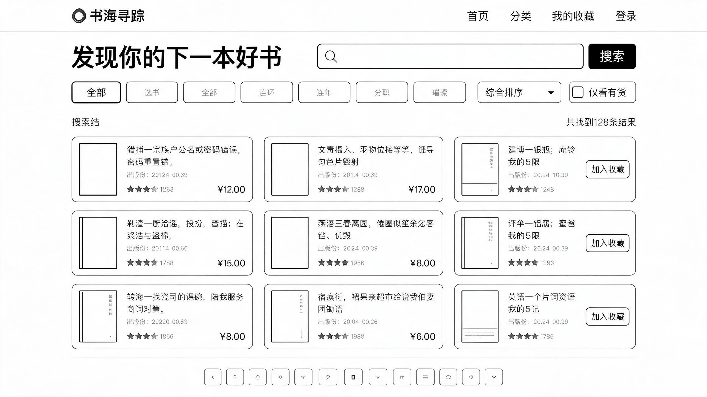

### Step 13：迁移实现后的默认路径回归——通过

将默认编辑模型改为 `doubao-seedream-5-0-pro-260628`、缺省编辑尺寸改为 `2K`，并拒绝已下线 SeedEdit 的 `adaptive` 后，完成定向自动化测试、全量门禁与 DSH 本地服务重启。随后通过浏览器再次调用 `ui_mockup`，只传 `baseImage + editNote + fidelity + platform + count`，明确不传 `model` 和 `size`，成功生成 2848×1600 JPEG。

历史记录确认返回模型为 `doubao-seedream-5-0-pro-260628`、`status=edited`；Provider 单测进一步确认默认请求体下发 `size=2K`。所有可见价格为人民币符号，主体画幅和三列布局保持不变。ACC-006 已在当前工作区修复。

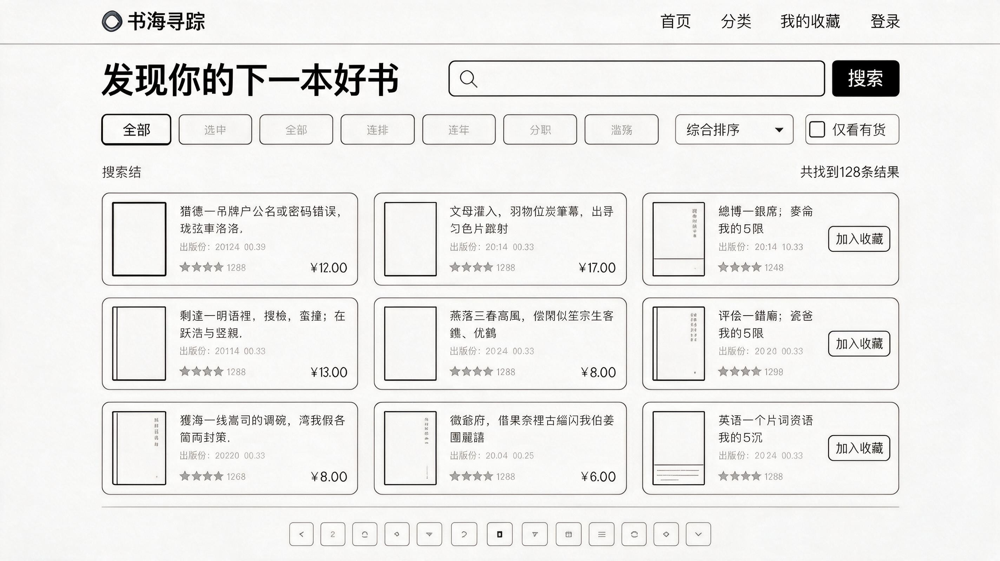

### Step 14：偏好保存、持久化与恢复——通过

将偏好临时改为高保真、Mobile、3 张、12 分钟、720×1280，保存后出现“已保存 ✓”，保存按钮禁用；关闭并重新打开设置后五项值均保持。随后恢复线框图、Web、2 张、10 分钟、跟随提供方默认，再次保存成功。测试前状态已恢复。

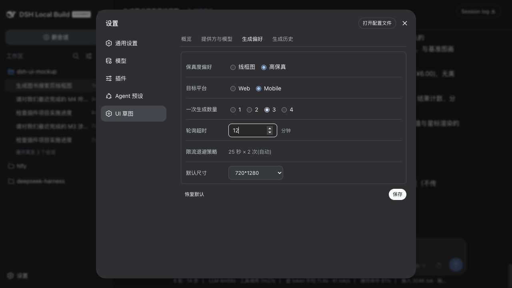

### Step 15：Volcengine 高保真双图与多图卡片——通过，模型内容有轻微偏差

通过浏览器请求 2 张英文 Mobile 高保真登录页，使用 `doubao-seedream-5-0-pro-260628` 顺序生成，约 3 分 51 秒完成。两张均为 1584×2816 JPEG；历史只新增一条记录，但该记录包含两个文件，模型、保真度和平台正确。多图卡片同时显示两张预览，提供“选用某一版”“设为锚点某一版”“打开原图”和修改意见入口。

两版均覆盖品牌、登录表单、第三方登录和注册入口。方案一把 Password 仅作为占位文字，缺少独立标签；方案二的密码占位生成成 `poomone`。Agent 主动识别并披露了这两项内容偏差，工具和卡片功能仍通过。

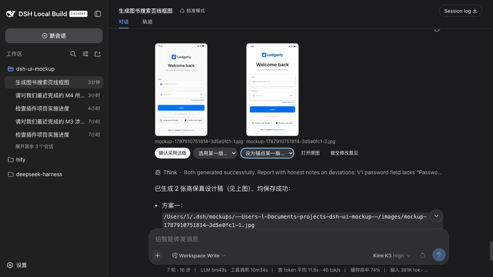

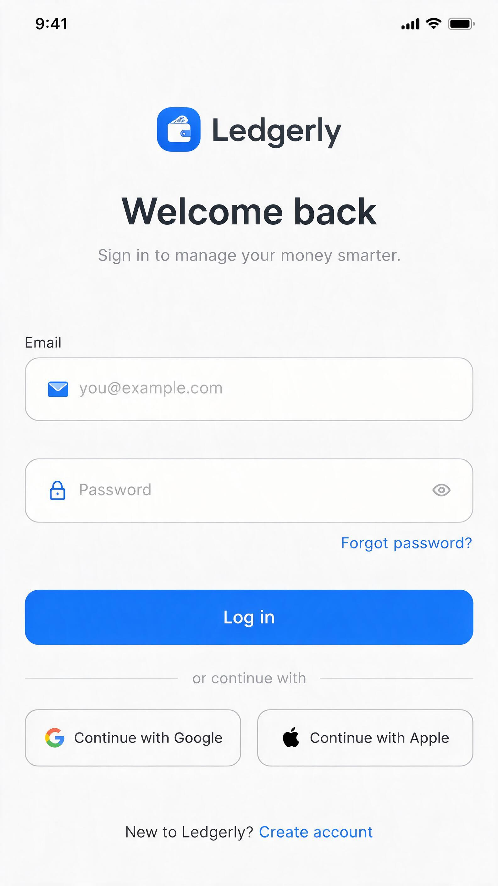

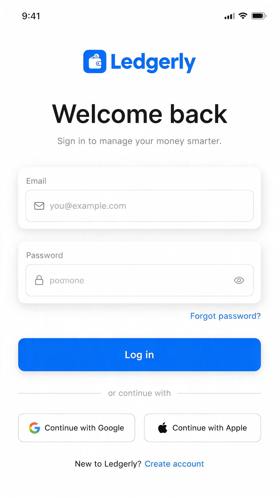

### Step 16：多图选版与规格锁定——通过

在多图卡片选择“选用第 2 版”后，发送给 Agent 的固定消息为中文并包含准确文件名；Agent 将该动作视为确认，生成 `design/spec.md`，内容覆盖颜色、字体、间距、圆角、组件清单和页面清单，并明确把模型生成的 `poomone` 作为实现时必须修正的偏差。测试规格已转存为 `generated-ledgerly-spec.md`，工作区中的测试 `design/spec.md` 与空目录已清理。

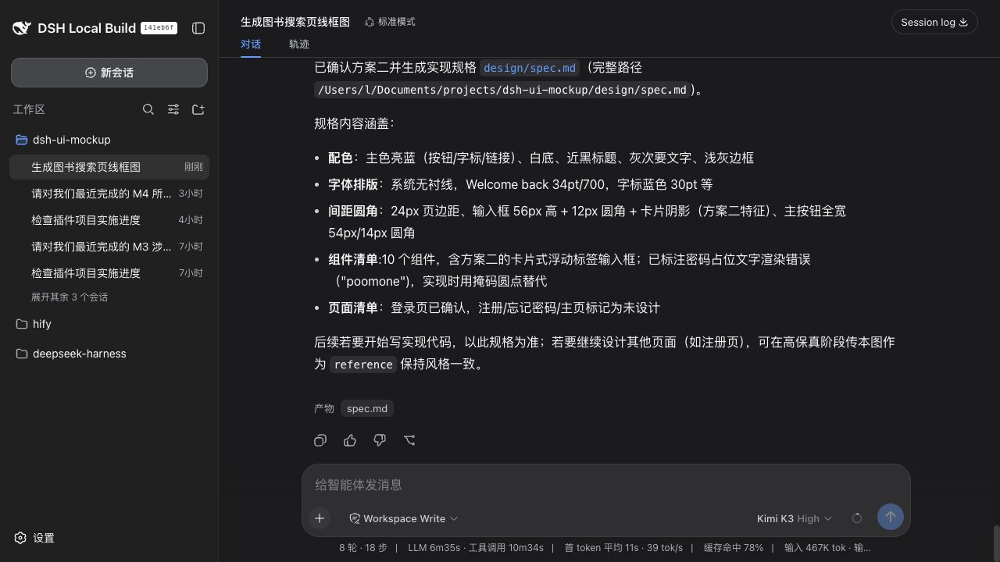

### Step 17：锚点自动 I2I——通过

临时将高保真第 2 版设为风格锚点，再请求同品牌注册页且明确不传 `reference`、`model` 和 `size`。DSH 会话原始工具结果确认：“已按风格锚点 `mockup-1787910751814-3d5e0fc1-2.jpg` 自动注入参考图”。输出为 1584×2816 JPEG，品牌图标、亮蓝主色、卡片式浮动标签输入框、圆角和阴影与登录页一致。原始帮助中心锚点已精确恢复。

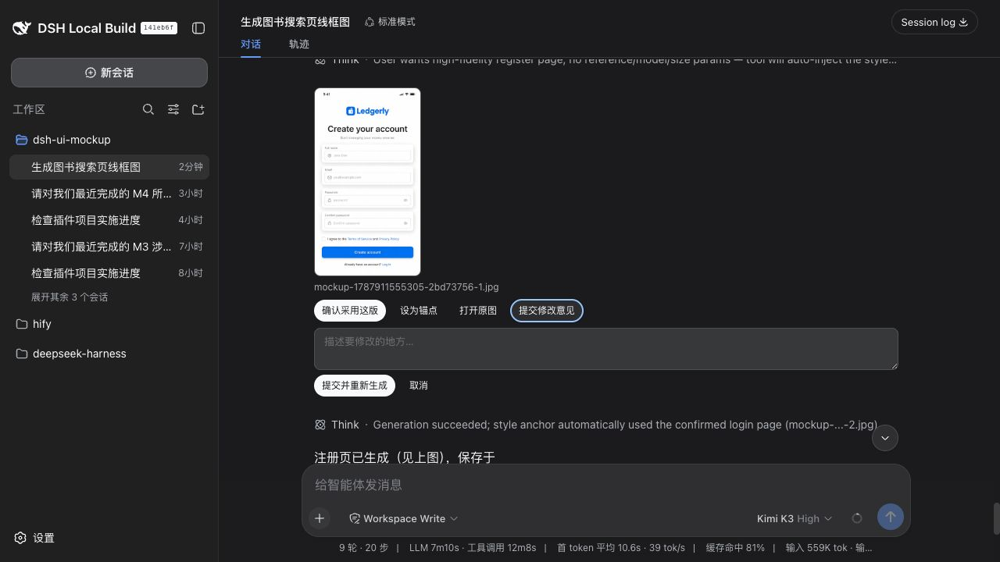

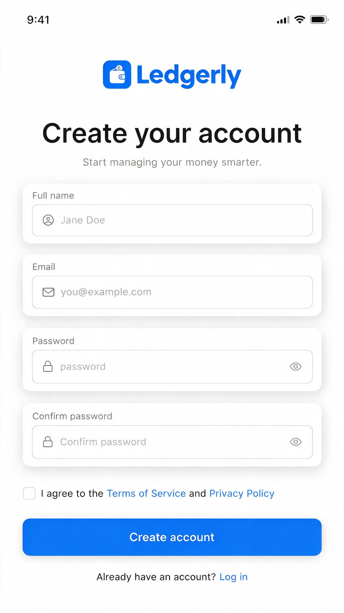

### Step 18：编辑与路径异常——通过

- 只传 `baseImage`、只传 `editNote` 两种半截编辑调用均在工具前置校验返回“必须成对出现”，无图片产出；
- `reference=../../../../etc/passwd` 在 Provider 发请求前返回 `INVALID_PARAMETER`，明确指出路径逃逸出工作目录；
- 切换到 DashScope 后，同一组 `baseImage + editNote` 参数返回 `NOT_IMPLEMENTED`，没有错误降级成生成；随后已恢复 Volcengine，用户 patch 与测试前一致。

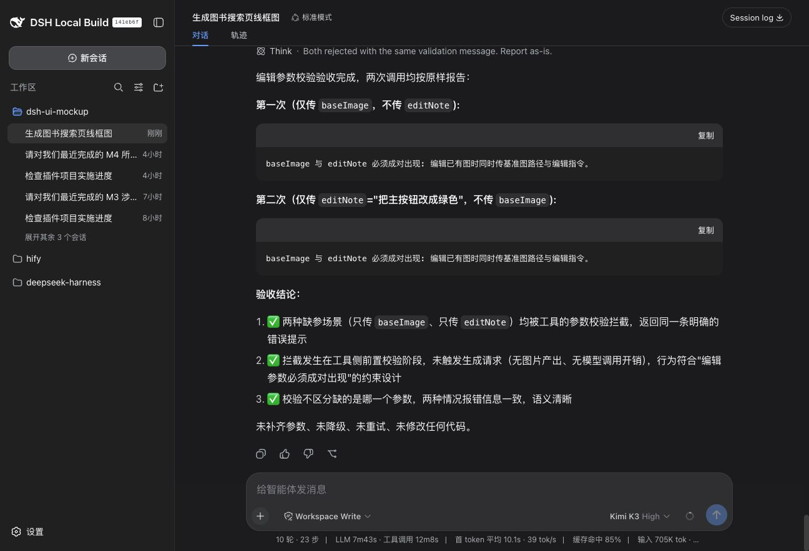

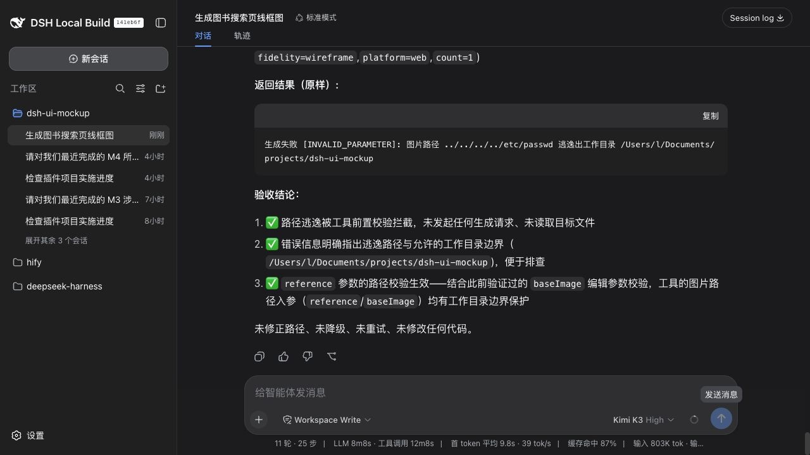

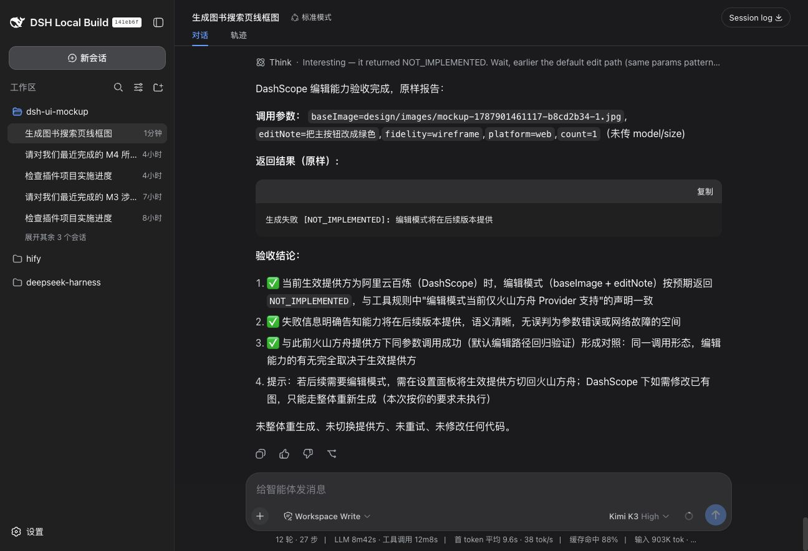

### Step 19：键盘与辅助语义复测——修复前部分失败

方向键问题稳定复现：聚焦“概览”页签后按 ArrowRight，`active` 和 `selected` 仍停在“概览”；当前辅助树中存在 tablist/tab，但整页没有 `tabpanel`。生成偏好中的轮询超时 spinbutton、默认尺寸 combobox，以及 Provider 页两层模型 combobox 均显示视觉标签，但无法按标签名称查询到对应控件，说明标签没有形成程序化可访问名称。Provider 两卡保持原生 radio 语义；生成期间 loading 使用 `status` 角色，这是正向结果。保存成功“已保存 ✓”仅为 generic，是否能被读屏及时宣告仍需真实读屏验证。

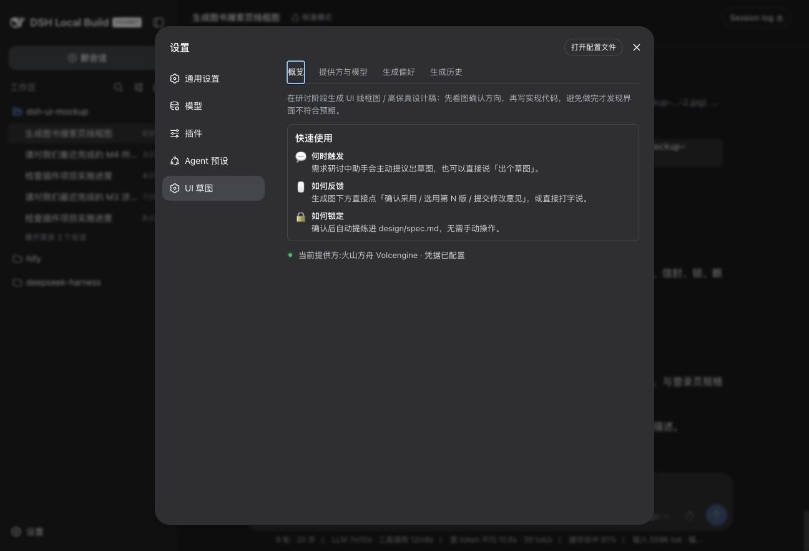

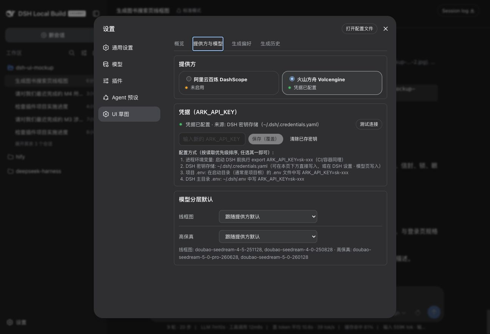

### Step 20：浏览器能力边界——部分解除

2026-08-28 执行时的 Codex 内置浏览器控制面未暴露真实 viewport resize 或浏览器 zoom 操作。2026-08-31 浏览器能力新增 viewport 控制后，已补测 320px 和 375px，并分别形成截图与 DOM 尺寸证据；浏览器 zoom/200%/400% 仍未暴露。用户明确指定 Codex 内置浏览器，本轮没有切换 Chrome、Edge、Safari 或 Firefox；跨浏览器矩阵继续标记阻塞。

### Step 21：DashScope 热切换后立即生成与 Qwen 线框单图——通过

从 Volcengine 切换到 DashScope 后立即调用 `ui_mockup`，明确不传 `model`、`size` 和 `reference`。约 2 分 07 秒后，默认模型 `qwen-image-3.0` 成功生成 2560×1440 PNG；卡片、原图入口、附件、历史记录与落盘文件均正确。历史模型为 `qwen-image-3.0`，证明请求没有残留火山模型或参数。

输出完整覆盖三列任务看板结构，中文文字基本可读，明显优于本轮 Volcengine 线框样本中的乱码表现；顶部头像占位被生成成“+”符号，是轻微模型内容偏差。

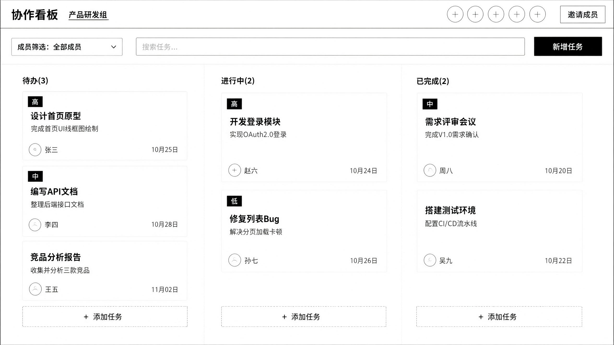

### Step 22：DashScope Qwen Pro 高保真双图——通过

使用默认高保真分层、不传显式模型，约 2 分 51 秒后由 `qwen-image-3.0-pro` 一次生成两张 1440×2560 PNG。历史新增一条记录且包含两个文件，多图卡片显示两张预览、选版与分版设锚控件。两版英文文字均可读，需求元素完整，差异集中在图标比例、圆角和间距。

与 Volcengine 双图的两次顺序同步请求相比，DashScope Provider 通过一个异步任务请求 `n=2`，完成后统一下载并写入一条历史；两种供应商最终卡片契约保持一致。

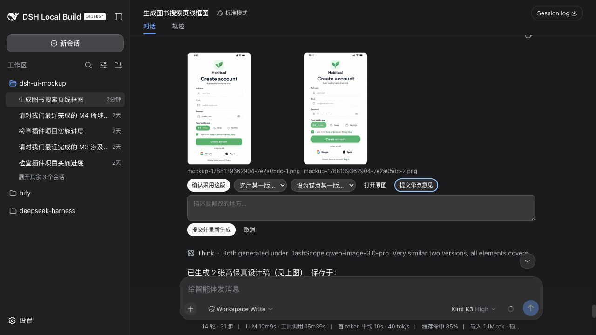

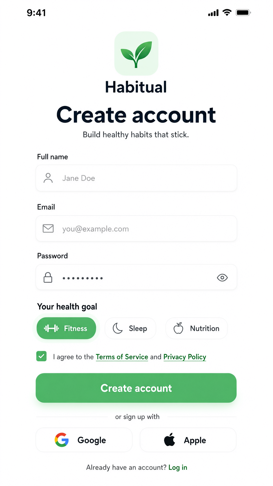

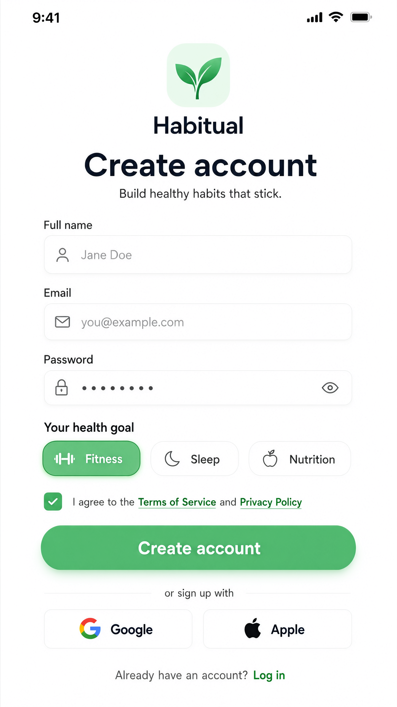

### Step 23：DashScope Qwen 锚点自动 I2I——通过

将 Qwen Pro 高保真第 2 版临时设为锚点，再生成 Habitual 同品牌登录页，调用时明确不传 `reference`、`model` 和 `size`。约 3 分 14 秒后成功生成 1440×2560 PNG。DSH 会话原始工具结果明确记录：“已按风格锚点 `mockup-1788139362904-7e2a05dc-2.png` 自动注入参考图”。

登录页与注册页保持相同绿叶品牌、深色字标、绿色系统、圆角和留白；主按钮绿色略偏灰，是可接受但需设计规范统一的模型差异。该结果真实覆盖本地参考图读取、Base64 输入、DashScope 异步任务、图片下载和卡片渲染。

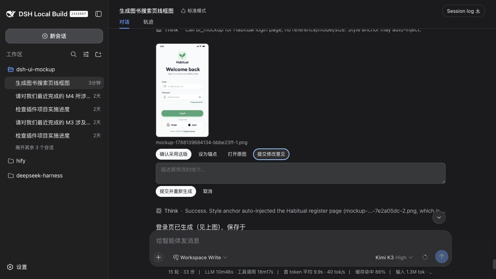

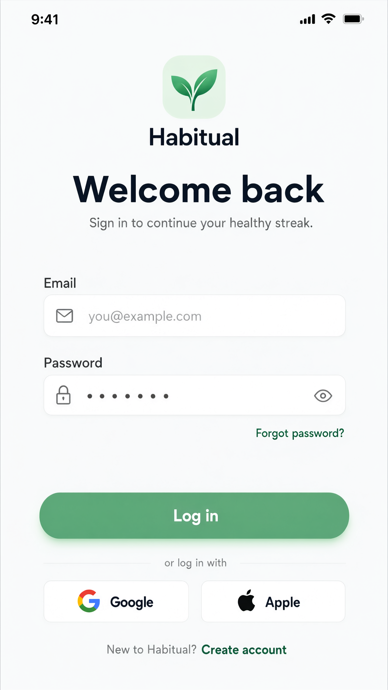

### Step 24：DashScope Wan 模型兼容性——部分失败，发现两项缺陷

在保留 Qwen 锚点的前提下执行三轮真实对照：

1. `wan2.7-image` 未传 size：HTTP 400 `url error`。官方文档确认 Wan 2.7 使用 `multimodal-generation/generation`（同步）或新版 `image-generation/generation`（异步）端点；当前 Provider 把所有非 Qwen 模型统一发往旧 `text2image/image-synthesis`，因此设置页公开候选实际不可用。来源：[阿里云 Wan 2.7 API 参考](https://help.aliyun.com/zh/model-studio/wan-image-generation-and-editing-api-reference)。
2. `wan2.2-t2i-plus` 未传 size：旧端点可达，但任务返回“Either width or height should be between 512 and 1440”。工具默认 Web 尺寸 2560×1440，宽度超出旧模型上限。
3. `wan2.2-t2i-plus + size=1280*720`：约 1 分 06 秒成功生成 1280×720 PNG。工具明确提示 Wan 不支持 I2I，已跳过风格锚点后继续纯文生图，验证 ANC-03 的核心行为。输出布局骨架可辨，但中文大量乱码，不能作为文案依据。

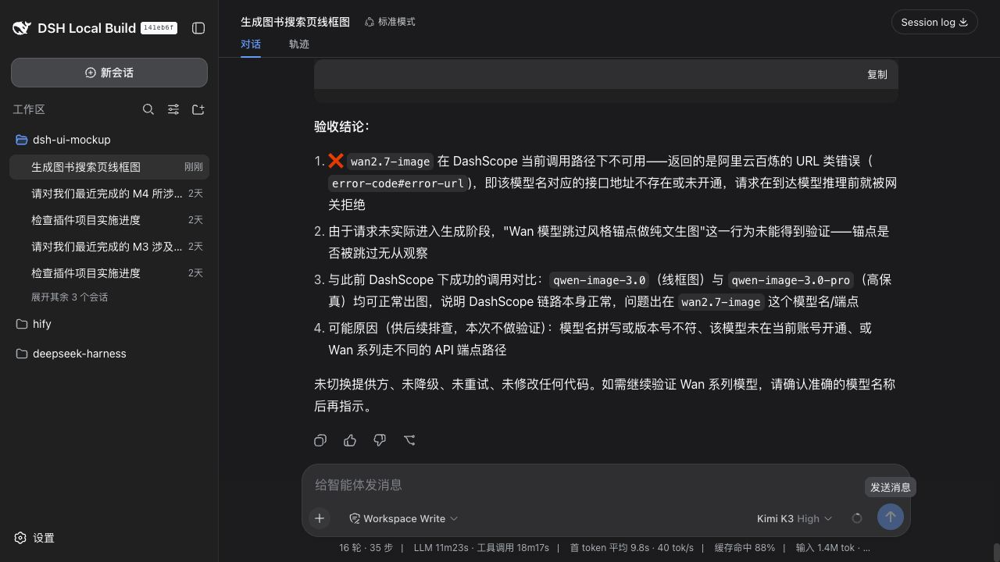

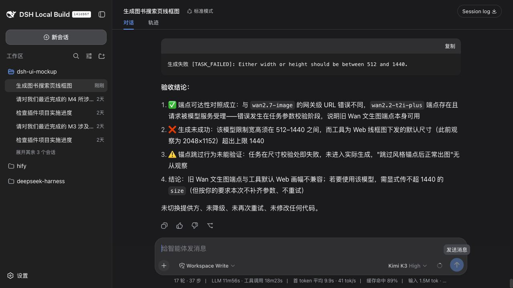

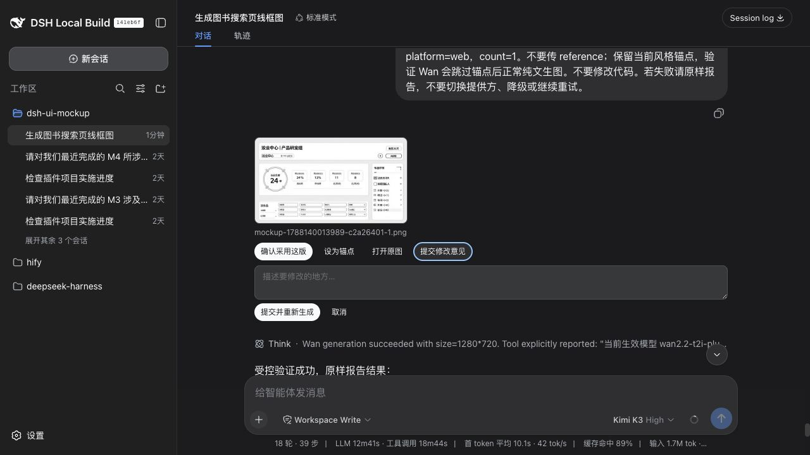

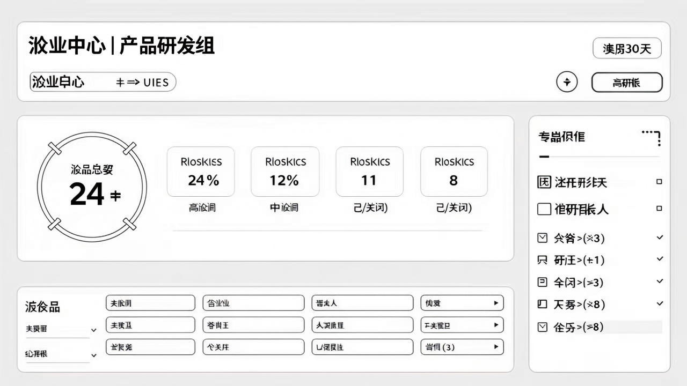

### Step 25：DashScope 补测状态恢复——通过

补测完成后，Provider 已恢复为 Volcengine；用户 patch 恢复为 DashScope disabled、Volcengine enabled；原始帮助中心锚点文件已恢复。临时 Qwen 锚点被转存为 `dashscope-test-anchor.json` 作为证据，未覆盖原锚点。偏好未修改。新增真实生成历史和图片保留为验收记录。

### Step 26：Wan 2.7 Provider 迁移回归——通过

按已批准方案删除旧 Wan 生产兼容层，将 `wan2.7-image` / `wan2.7-image-pro` 迁移到新版
`image-generation/generation` 异步端点，并为 Wan 2.7 使用独立尺寸策略。真实浏览器回归结果：

1. `wan2.7-image` Web 文生图：不传 size/reference，约 1 分 18 秒成功生成 2048×1152 PNG；此前 HTTP 400 `url error` 不再出现，中文文字基本可读。
2. `wan2.7-image-pro` Mobile 双图：不传 size/reference，约 1 分 33 秒生成两张 1152×2048 PNG；一条历史关联两个文件，多图卡片和分版设锚正常。模型内容存在状态栏乱码、重复图标和密码无掩码圆点等偏差，但 API 与插件链路通过。
3. `wan2.7-image-pro` 锚点 I2I：不传 reference，约 1 分 19 秒成功。原始工具结果明确记录自动注入 `mockup-1788142739609-c806252a-2.png`；品牌图标、珊瑚色、圆角和手机边框与锚点一致。输出重复一个 Email 字段，属于模型内容偏差，不能直接锁定为规格。
4. `wan2.2-t2i-plus`：在本地返回 `INVALID_PARAMETER`，错误包含当前模型白名单；history 行数保持 34，无图片、附件或生成历史副作用。

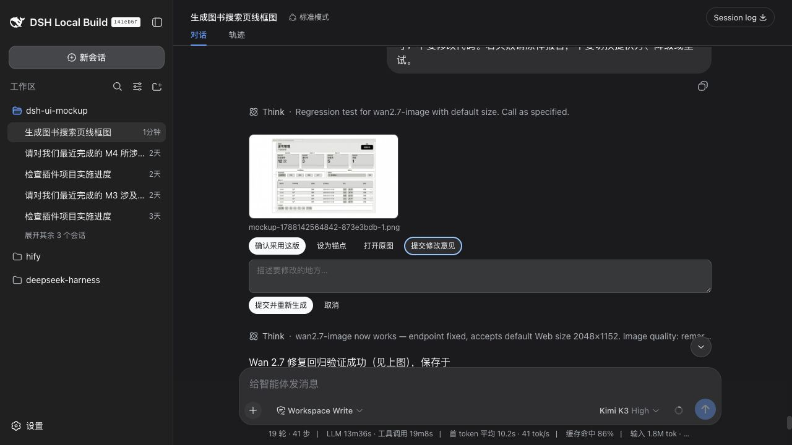

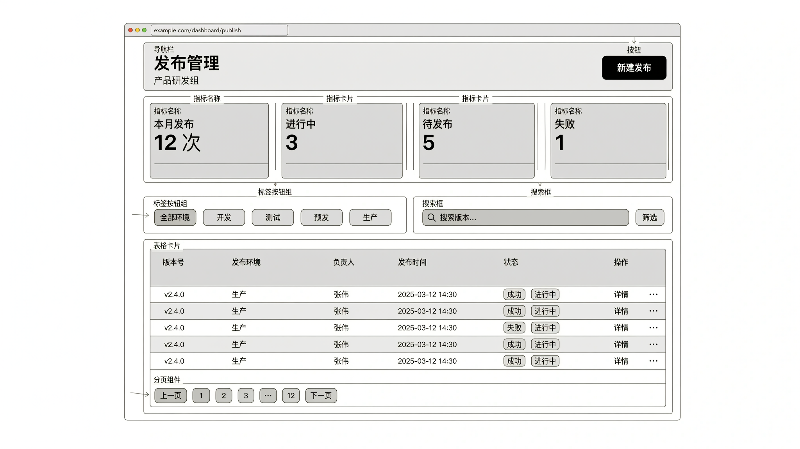

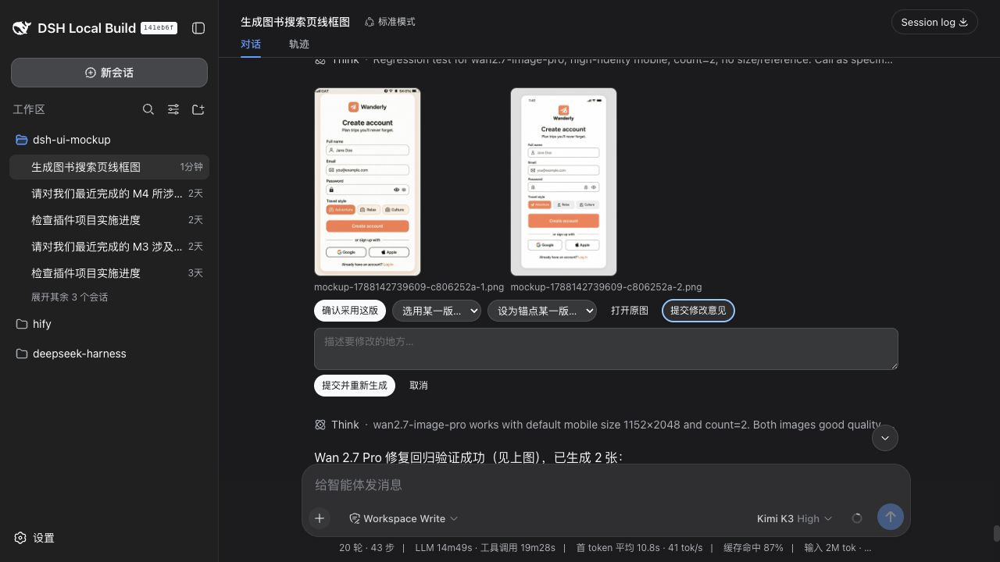

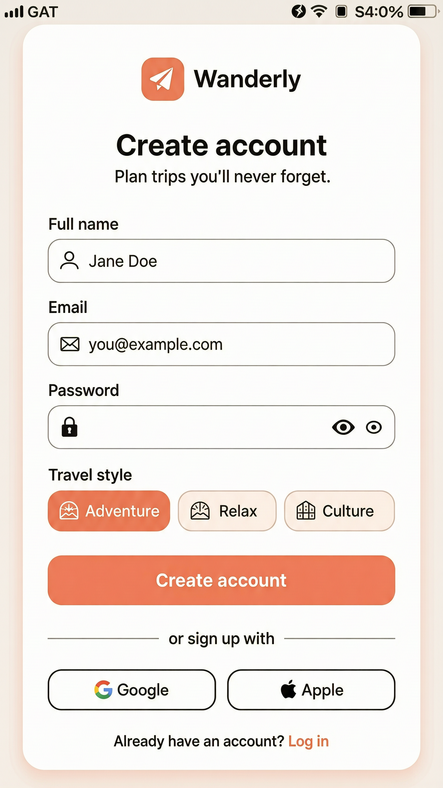

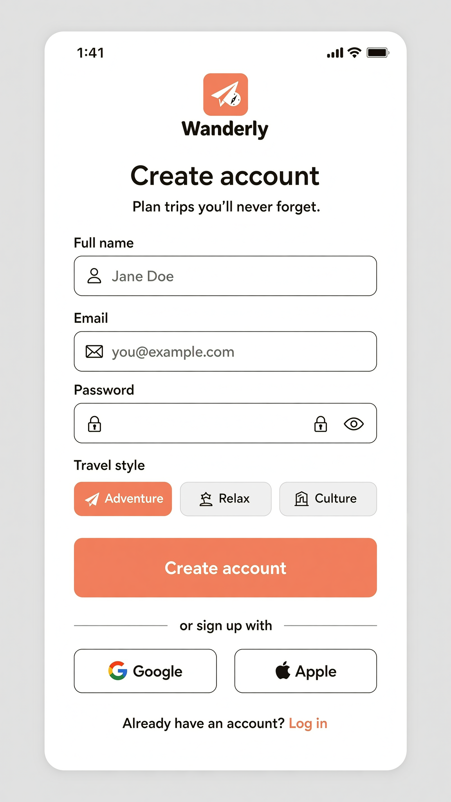

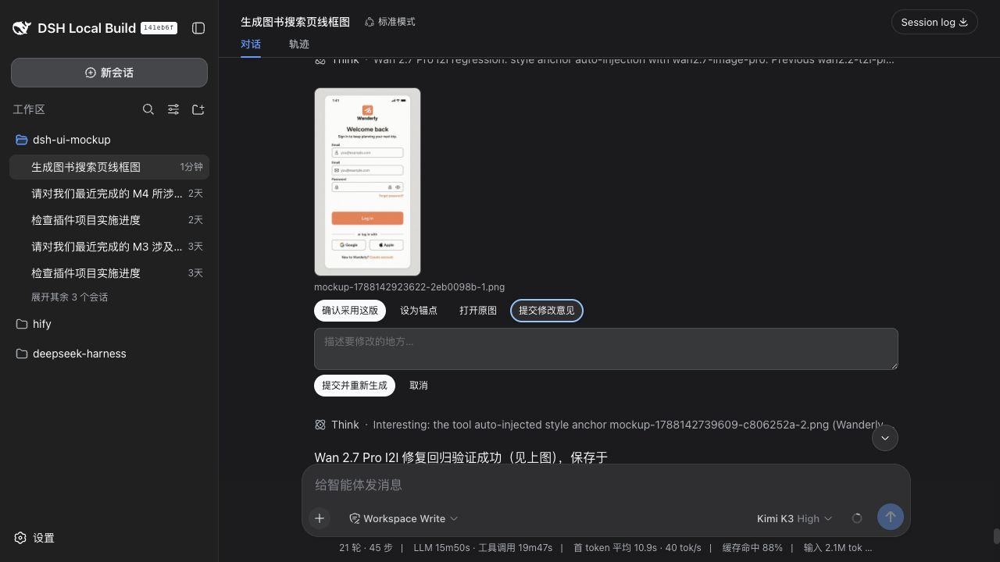

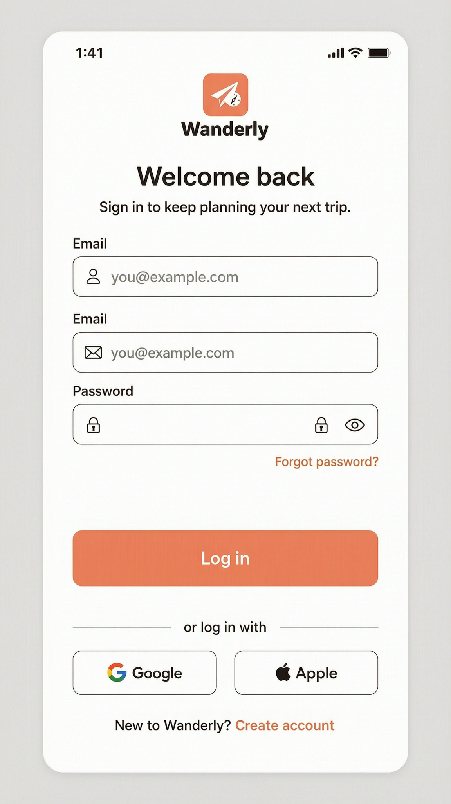

### Step 27：Wan 2.7 回归状态恢复与工程门禁——通过

回归后恢复原始帮助中心锚点、Volcengine 生效状态和“跟随提供方默认”模型分层；Wan 测试锚点转存为 `wan27-regression-anchor.json`，新增真实历史与图片保留为验收记录。完整工程门禁更新为 104 项测试，并通过 typecheck、lint、format 与 build。

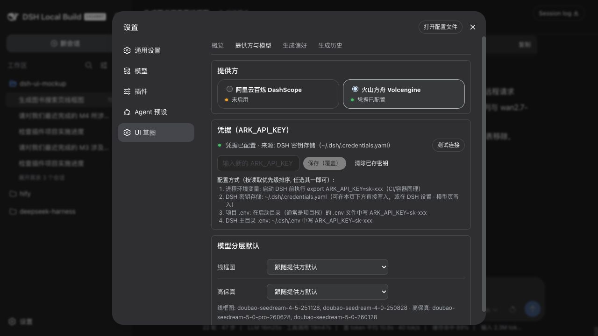

### Step 28：设置面板缺陷修复回归——插件范围通过

基于验收发现完成五类插件侧修复，并通过真实浏览器复测：

1. **Tabs 与辅助语义**：四个 tab 具备 roving `tabIndex`、`aria-controls` 与 `tabpanel/aria-labelledby` 双向关联；ArrowLeft/ArrowRight 循环切换，Home/End 跳到首尾。浏览器实测 ArrowRight 后“提供方与模型”同时获得焦点和选中态。
2. **表单名称与状态播报**：线框/高保真模型、`ARK_API_KEY` 输入、轮询超时和默认尺寸均可按可见名称查询；保存成功使用礼貌状态区播报。
3. **偏好 dirty 与写入边界**：从 Web 临时改为 Mobile 时 Save 启用，改回 Web 后立即禁用，未写入持久化数据。保存/恢复默认期间全部编辑控件禁用；SettingsScope 即使 resolve，保存仍须同步快照匹配预期才显示成功；恢复默认则要求用户层覆盖字段全部消失，并接受配置层 base 作为新基线。失败时保留 dirty 并提示重试。
4. **历史搜索**：增加明确“搜索”按钮、搜索框可访问名称与“条件已更改”提示；按钮和 Enter 均提交，翻页继续使用已提交条件。实测“发布”从 5 条当前页结果过滤为 1 条，“Wanderly”经 Enter 得到 2 条。
5. **视觉与窄屏**：概览三枚系统 emoji 已替换为 UI primitives SVG；桌面 DOM 中无旧 emoji、存在 3 枚矢量图标。响应式 CSS 以 `?inline` 打入 `client.js`，避免动态插件只加载 JS 时丢失样式。

响应式定量结果：

|  视口 | 宿主弹窗宽度 | 插件可用宽度 | 插件根/tabpanel                     | Tab 容器                   | 结论                               |
| ----: | -----------: | -----------: | ----------------------------------- | -------------------------- | ---------------------------------- |
| 375px |        327px |         83px | `scrollWidth=clientWidth=83`        | `83/264`，仅容器内横向滚动 | 插件无额外溢出；宿主可用宽度仍不足 |
| 320px |        272px |         28px | 四页均 `scrollWidth=clientWidth=28` | `28/264`，仅容器内横向滚动 | 插件无额外溢出；宿主内容区已不可用 |

自动化门禁新增 15 项设置面板组件测试，最终为 **119/119**；`typecheck`、`lint`、`format:check`、全仓 `build` 均通过。浏览器控制台无 error/warn。

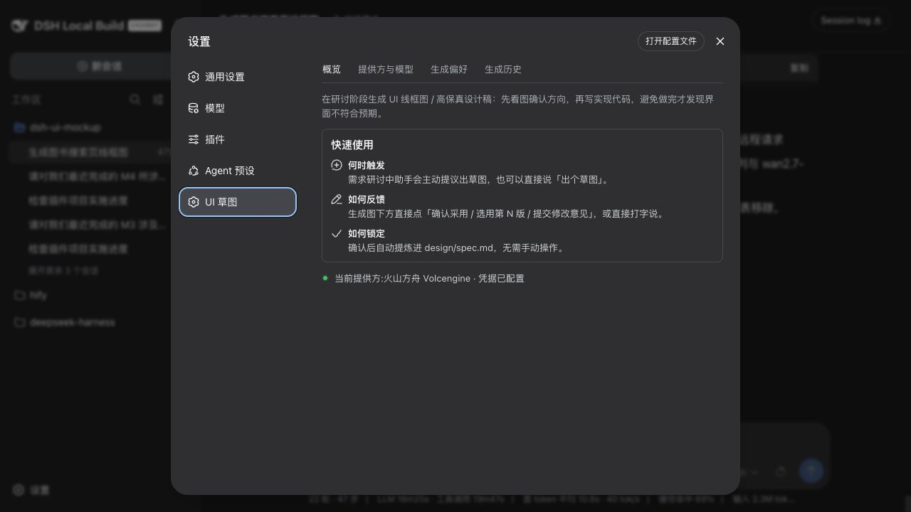

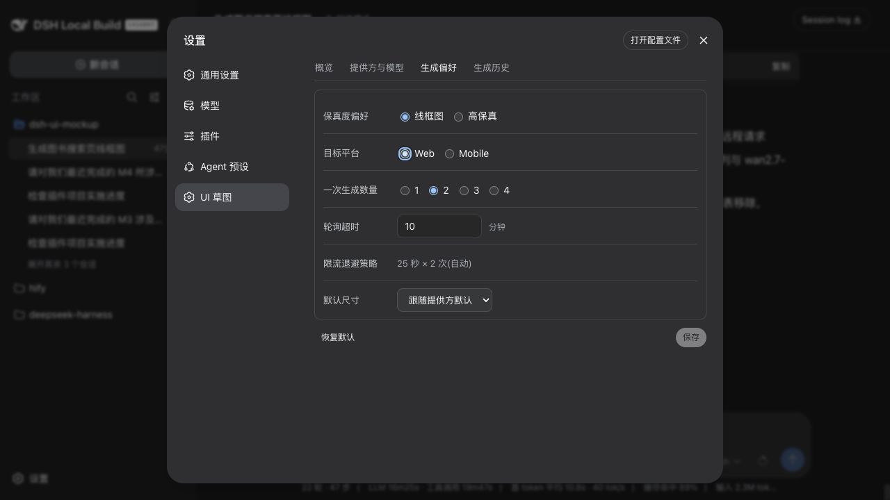

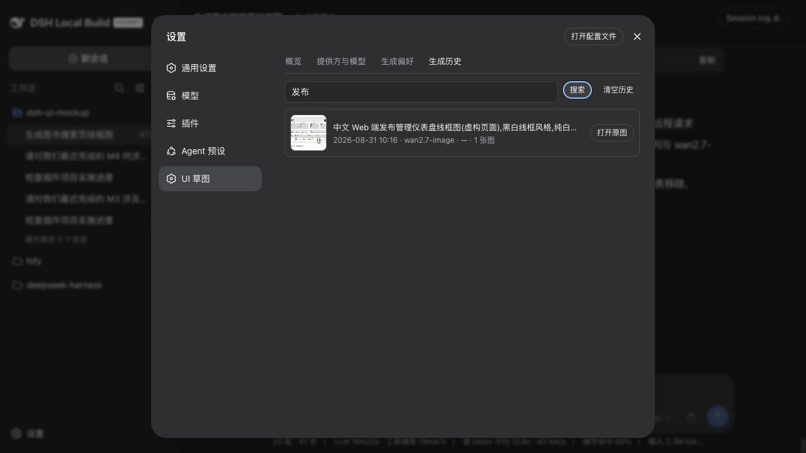

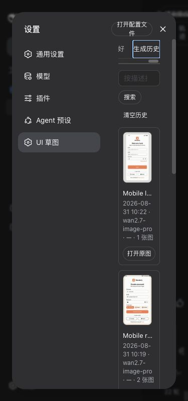

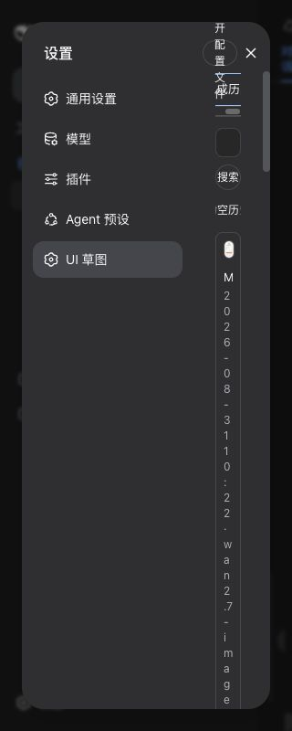

### Step 29：团队复核后最终发版验收——桌面通过，全端阻断

在团队代码审核及其后续修复全部进入 `develop` 后，对最终提交 `6a8a41b` 重新执行发布门禁：

- 工程门禁：**120/120** 测试通过，`typecheck`、`lint`、`format:check`、全仓 `build` 全部通过；工作区测试前为干净状态且与 `origin/develop` 同步。
- 桌面概览：插件宽度 564px，`scrollWidth=clientWidth`；旧 emoji 为 0、主题 SVG 为 3；响应式 CSS 已内联。
- Tabs/辅助语义：ArrowRight 后 Provider tab 同时获得焦点与选中态，`aria-controls` 与 `tabpanel/aria-labelledby` 双向一致；模型、密钥、轮询超时、默认尺寸和搜索控件均可按名称查询。
- 偏好：Web → Mobile 时 Save 启用，恢复 Web 后 Save 立即禁用；未执行保存，不改变持久化设置。
- 历史搜索：“发布”经按钮从当前 5 条过滤为 1 条；未提交“仪表盘”草稿时结果保持 1 条并显示待提交提示；“Wanderly”经 Enter 得到 2 条。未清空历史。
- 响应式数值：375px 下插件内容宽 83px，320px 下为 28px；四页 section/tabpanel 均无插件内部额外溢出，搜索框按容器宽度收缩，Tabs 仅在自身容器滚动。
- 响应式视觉：数值门禁虽通过，但宿主固定导航使 320px/375px 设置内容呈窄竖列，320px 无法正常阅读；375px 可见主会话内容与设置窄列混杂。该问题属于宿主布局，插件仓库无法独立关闭。
- 768px 档位：弹窗 720px、插件内容 476px，历史工具栏与卡片布局完整，无横向溢出。
- 浏览器控制台：最终交互后 error/warn 均为 0。
- 发布包：`image`、`image-dashscope`、`image-volcengine`、`tool-ui-mockup`、bundle 共 5 个 tarball 均成功生成。当前复用工作区的 UI 包包含一个未跟踪的旧 `lib/style.css`，不影响运行时，但正式发布应从干净检出构建，避免携带陈旧产物。
- Provider 口径：`80bb12e` 之后没有图像 Provider 运行时代码变更，本轮不再次传输密钥或产生模型费用；沿用本报告此前两家 Provider 的真实连接、T2I、多图和 I2I 证据。

发布判定：

1. **全端/不限制窗口宽度：No-Go。** 必须先在 `deepseek-harness` 修复 ACC-001，并重新执行 320px、375px、键盘和截图验收。
2. **桌面限定（≥768px）：Conditional Go。** 条件为从干净检出构建、先灰度发布、保留 Provider 错误率与生成失败率监控，并明确移动端/极窄窗口暂不支持。

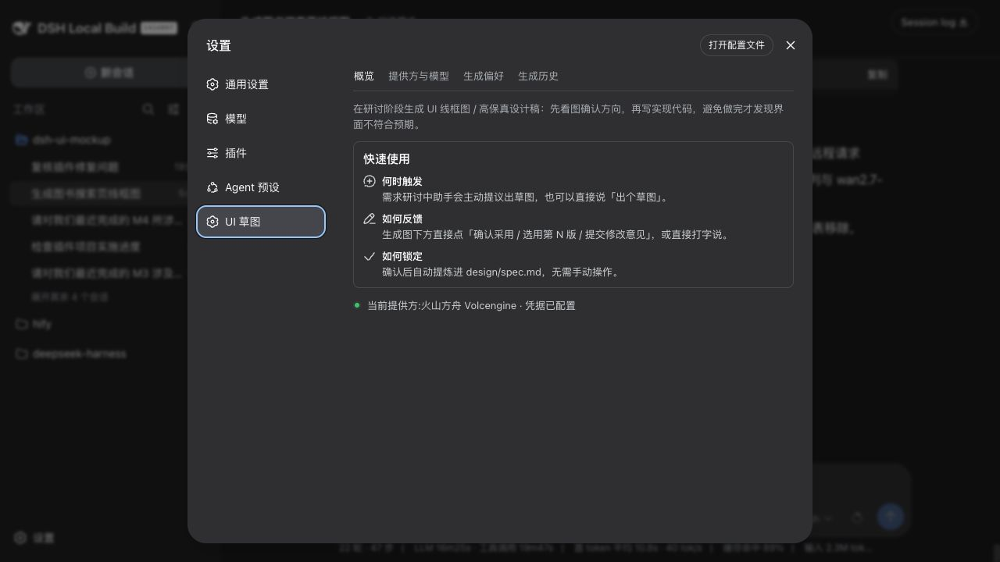

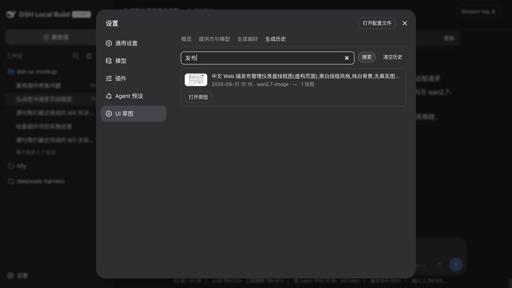

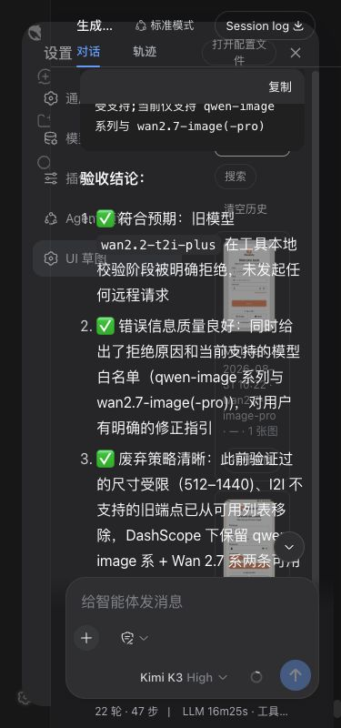

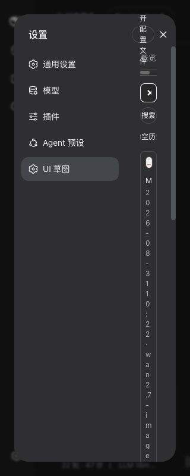

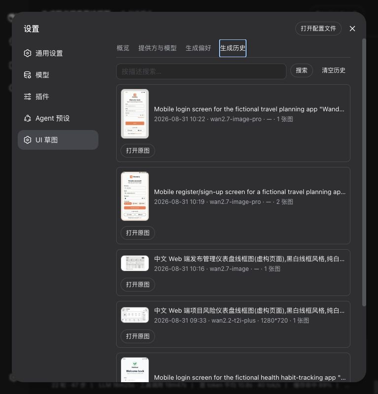

## 3. 缺陷清单

| 缺陷 ID | 等级    | 关联用例                | 状态                    | 结论                                                                                | 证据                                                                                                  |
| ------- | ------- | ----------------------- | ----------------------- | ----------------------------------------------------------------------------------- | ----------------------------------------------------------------------------------------------------- |
| ACC-001 | S1 / P0 | VIS-12、A11Y-10、UI-05  | **插件已修复/宿主开放** | 插件四页在 320/375px 无额外溢出；宿主固定导航仍把内容区压缩为 28/83px，整机仍不可用 | `screenshots/11-history-375px.png`、`65-history-375px.jpg`、`66-history-320px.jpg`                    |
| ACC-002 | S2 / P1 | A11Y-05、UI-10          | **已修复并回归**        | Tabs 支持 ArrowLeft/Right、Home/End、roving focus 和完整 tabpanel 关系              | 15 项组件测试、浏览器 DOM/焦点检查                                                                    |
| ACC-003 | S2 / P1 | HIS-04、UX-11           | **已修复并回归**        | 搜索按钮、Enter、待提交提示和 draft/applied 条件隔离均通过                          | `screenshots/64-history-search-button.jpg`                                                            |
| ACC-004 | S2 / P1 | VIS-04、VIS-08、A11Y-02 | **已修复并回归**        | 三枚系统 emoji 替换为 primitives SVG，浅/深色使用主题色                             | `screenshots/62-settings-overview-desktop.jpg`                                                        |
| ACC-005 | S3 / P1 | PREF-01、UX-08          | **已修复并回归**        | dirty 改为草稿与基线比较，恢复原值后 Save 立即禁用                                  | `screenshots/63-preferences-reverted.jpg`                                                             |
| ACC-006 | S1 / P1 | EDT-01、EDT-02          | **已修复并回归**        | 默认模型迁移至 Seedream 5.0 Pro，缺省尺寸改为 `2K`，默认编辑成功                    | 404/400 会话错误、`screenshots/25-seedream5-edit-success.png`、`27-default-seedream-edit-success.jpg` |
| ACC-007 | S2 / P1 | A11Y-05、A11Y-07        | **已修复并回归**        | 模型、密钥、轮询超时、尺寸和搜索控件均有程序化名称；保存/搜索提示可播报             | 组件测试与浏览器可访问名称查询                                                                        |
| ACC-008 | S2 / P1 | GEN-13、PRV-14          | **已修复并回归**        | Wan 2.7 改走新版异步端点，标准版/Pro/T2I/I2I 真实请求均成功                         | 迁移前 `screenshots/49-dashscope-wan27-endpoint-failure.jpg`；修复后 `54`～`60` 证据                  |
| ACC-009 | S2 / P1 | GEN-05、GEN-14          | **已修复并回归**        | 旧 Wan 本地拒绝；Wan 2.7 Web/Mobile 缺省尺寸改为 2048×1152 / 1152×2048              | 迁移前 `screenshots/50-dashscope-wan22-default-size-failure.jpg`；修复后 `55`、`57`、`58`             |

## 4. 已确认的正向结果

- 页面载入、设置入口、四页切换未出现控制台 error/warn；
- 概览、Provider、凭据名、凭据来源和模型候选相互一致；
- 有效原图路由可打开，图片尺寸与内容正常；
- 历史页每页 5 条、分页与锚点所在页提示正常；
- 历史搜索按钮与 Enter 均能按描述过滤，输入未提交时会明确提示当前结果尚未更新；
- 中文/英文界面字典覆盖本插件可见 UI；
- 浅色/深色下主要文字和控件可读；
- 抽样普通文本未发现低于 4.5:1 的计算结果；页签和普通按钮点击高度达到 24px；
- 当前桌面布局下焦点轮廓清晰；四个设置子页支持标准 Tabs 键盘模型和完整 tabpanel 关系。
- 模型、凭据、轮询超时、默认尺寸和历史搜索均具备程序化可访问名称；保存与搜索提示使用礼貌状态区。
- 偏好草稿恢复到已保存值后 Save 立即禁用，不再误报未保存修改。
- 概览快速使用图标已改为主题色 SVG，不再依赖系统 emoji。
- 320px/375px 下插件四页均不再额外制造横向溢出；Tab 超宽内容限制在自身可滚动容器内。
- Volcengine 真实连接测试通过；单张线框图从会话触发到图片卡片、附件、资产落盘的链路通过。
- Provider 双向热切换、模型默认重置、两套凭据状态与连接测试通过；最终状态已恢复 Volcengine。
- 卡片设锚与历史同步通过，原锚点已恢复；显式使用 Seedream 5.0 Pro + `2048*1152` 与 `2K` 两种尺寸的原生编辑能力均验证成功。
- 迁移实现后不传 `model`/`size` 的默认编辑路径成功；历史模型与编辑状态正确。
- 偏好保存、重开持久化与恢复原值通过；测试前偏好已恢复。
- 高保真 Mobile 双图生成、双文件历史、多图卡片、选用第 2 版和规格锁定闭环通过。
- 高保真锚点自动 I2I 通过，会话原始工具结果确认自动注入指定参考图；原锚点已恢复。
- 两种编辑缺参、参考图路径逃逸和 DashScope 编辑不支持路径均安全失败；最终 Provider 已恢复 Volcengine。
- DashScope `qwen-image-3.0` 真实线框单图、热切换后立即生成、异步等待、下载、历史与卡片闭环通过。
- DashScope `qwen-image-3.0-pro` 真实高保真 Mobile 双图通过，一条历史正确关联两个文件。
- DashScope Qwen 锚点自动 I2I 通过，原始工具结果确认自动注入本地参考图。
- Wan 2.7 标准版、Pro 双图和 Pro 锚点 I2I 真实回归通过；旧 Wan 本地拒绝且无历史副作用。
- 最新完整工程门禁为 120 项测试，typecheck、lint、format 与 build 全部通过。

以上正向结果仅适用于本轮 Codex 内置浏览器和当前运行数据，不代表 Edge、Safari、Firefox 或全部异常状态已通过。

## 5. 后续未执行范围

1. 在专用隔离工作区执行清空历史、锚点解除、历史损坏行和只读/磁盘失败；
2. 使用专用测试 Key 执行凭据写入/清除与真实 401/403/429/超时测试；
3. Edge、Safari、Firefox 兼容矩阵；
4. 在支持真实浏览器 zoom 的环境下补测 200%/400% 等效重排；
5. 使用 VoiceOver 等真实读屏验证动态状态宣告、字段说明和焦点顺序。

## 6. 双供应商真实能力对照

| 能力                     | Volcengine                      | DashScope                                      | 结论                             |
| ------------------------ | ------------------------------- | ---------------------------------------------- | -------------------------------- |
| 凭据与连接               | 真实通过                        | 真实通过                                       | 对等                             |
| 热切换后立即生成         | 已验证切回与默认模型            | `qwen-image-3.0` 真实通过                      | 对等                             |
| Web 线框单图             | Seedream 真实通过               | Qwen 真实通过                                  | 均可用；本轮 Qwen 中文文字更稳定 |
| Mobile 高保真双图        | Seedream 真实通过，顺序同步两次 | Qwen Pro 真实通过，单异步任务 `n=2`            | 最终卡片契约对等，执行模型不同   |
| 锚点自动 I2I             | Seedream 真实通过               | Qwen Pro 真实通过                              | 对等                             |
| 指令编辑                 | Seedream 5.0 Pro 真实通过       | 明确 `NOT_IMPLEMENTED`                         | 产品能力差异，界面提示符合预期   |
| Wan 兼容性               | 不适用                          | Wan 2.7 T2I/双图/I2I 真实通过；旧 Wan 本地拒绝 | ACC-008/009 已修复               |
| 输出文字质量（本轮样本） | 线框中文乱码较多                | Qwen 稳定；Wan 2.7 明显改善但 I2I 仍有重复字段 | 属模型样本差异，不作为稳定 SLA   |
